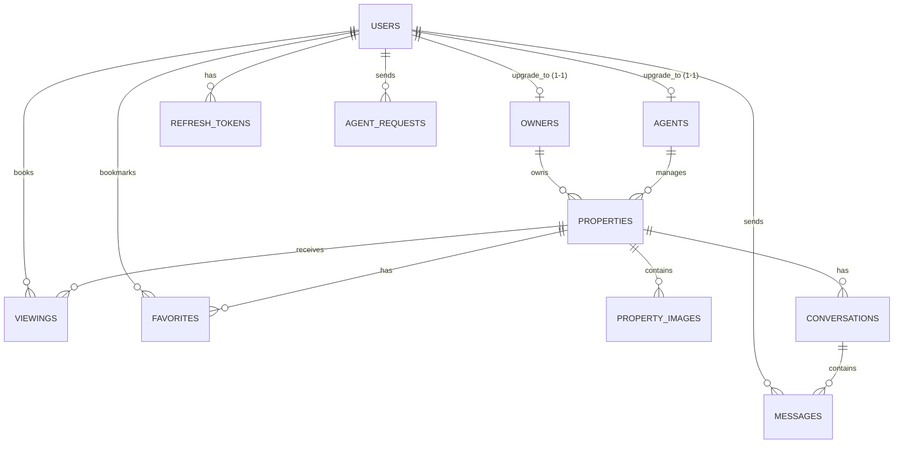

# 🗄️ Thiết Kế Cơ Sở Dữ Liệu - Real Estate Management Platform

Tài liệu này mô tả chi tiết kiến trúc, schema, và mối quan hệ giữa các bảng (entities) trong hệ thống bất động sản, được đồng bộ trực tiếp từ các file migration Flyway (`V1` đến `V8`).

---

## 🏛️ Sơ Đồ Quan Hệ Thực Thể (ERD)

### 📊 Sơ Đồ Cấp Bậc (Hierarchical View)

**Level 1: Core Entity**
```
users (Tất cả tài khoản hệ thống)
```

**Level 2: User Extensions (1-to-1 upgrade)**
```
users
├── owners (Chủ sở hữu bất động sản)
├── agents (Môi giới bất động sản)
└── (Khách hàng thường không nâng cấp)
```

**Level 3: Main Resources**
```
users
├── properties (Bất động sản - Owner/Agent quản lý)
├── viewings (Lịch hẹn xem nhà - Khách hàng đặt)
├── favorites (Yêu thích tin đăng - Khách hàng lưu)
├── conversations (Cuộc chat - Giữa khách hàng và người bán)
├── messages (Tin nhắn chi tiết - Người dùng gửi)
├── refresh_tokens (Refresh Token duy trì phiên - Người dùng có)
└── agent_requests (Yêu cầu làm môi giới - Người dùng gửi)
```

**Level 4: Sub Resources**
```
properties
├── property_images (Hình ảnh thực tế của tài sản)
├── viewings (Lịch hẹn xem tài sản này)
├── favorites (Lượt yêu thích tài sản này)
└── conversations (Cuộc chat thảo luận về tài sản này)

conversations
└── messages (Lịch sử tin nhắn trong cuộc chat này)
```

---

### Biểu Đồ Box Diagram (Chi Tiết Relationships)

```
┌────────────────────────────────────────────────────────────────────────────────────────┐
│                                        USERS                                           │
│  (id, username, email, password, full_name, phone, role, is_active, is_deleted, t/s)   │
└─────────┬───────────┬──────────┬────────────┬──────────┬────────────┬──────────────────┘
          │           │          │            │          │            │
    ┌─────▼───┐  ┌────▼────┐ ┌──▼────┐  ┌──▼─────┐ ┌──▼────────┐ ┌────▼──────────┐
    │ OWNERS  │  │ AGENTS  │ │VIEWING│  │FAVORITE│ │REFRESH_   │ │AGENT_REQUESTS │
    │(1-to-1) │  │(1-to-1) │ │(books)│  │(marks) │ │TOKEN      │ │(requests)     │
    └────┬────┘  └────┬────┘ └───┬───┘  └───┬────┘ └───────────┘ └───────────────┘
         │            │          │          │
         └──────┬─────┘          │          │
                │                │          │
        ┌───────▼──────┐         │          │
        │  PROPERTIES  │◄────────┴──────────┘
        │ (owner_id FK)│
        │ (agent_id FK)│
        └───────┬──────┘
                │
        ┌───────┴──────────────────┐
        │                          │
    ┌───▼──────────┐      ┌───────▼──────┐
    │PROP_IMAGES   │      │CONVERSATIONS │
    │(property_id) │      │(property_id) │
    └──────────────┘      │(user_one_id) │
                          │(user_two_id) │
                          └───┬──────────┘
                              │
                          ┌───▼──────────┐
                          │  MESSAGES    │
                          │(conversation)│
                          │(sender_id)   │
                          └──────────────┘
```

*Ghi chú: Cơ chế OTP được lưu trữ trực tiếp trên bộ đệm RAM (In-Memory Memory Store) sử dụng `ConcurrentHashMap` để tối ưu tốc độ xác thực và bảo mật, không tạo bảng vật lý trong DB.*

---

### Mermaid ERD (Chi Tiết)



### Bảng Relationships

| Source Table | Target Table | Type | Cardinality | Foreign Key Column | Mô Tả |
|--------------|--------------|------|-------------|--------------------|-------|
| `users` | `owners` | 1-to-1 | 1:1 | `owners.user_id` | Nâng cấp tài khoản thành chủ nhà |
| `users` | `agents` | 1-to-1 | 1:1 | `agents.user_id` | Nâng cấp tài khoản thành môi giới |
| `owners` | `properties` | 1-to-many | 1:N | `properties.owner_id` | Chủ nhà sở hữu tin đăng BDS |
| `agents` | `properties` | 1-to-many | 1:N | `properties.agent_id` | Môi giới được ủy quyền quản lý tin |
| `properties` | `property_images` | 1-to-many | 1:N | `property_images.property_id` | Một tin đăng có nhiều ảnh đính kèm |
| `properties` | `viewings` | 1-to-many | 1:N | `viewings.property_id` | Lịch hẹn xem một bất động sản cụ thể |
| `properties` | `favorites` | 1-to-many | 1:N | `favorites.property_id` | Bất động sản được nhiều người thích |
| `properties` | `conversations` | 1-to-many | 1:N | `conversations.property_id` | Các cuộc chat xoay quanh tin đăng |
| `users` | `viewings` | 1-to-many | 1:N | `viewings.user_id` | Khách hàng đặt lịch hẹn xem nhà |
| `users` | `favorites` | 1-to-many | 1:N | `favorites.user_id` | Khách hàng lưu tin đăng yêu thích |
| `users` | `messages` | 1-to-many | 1:N | `messages.sender_id` | Người dùng gửi tin nhắn trò chuyện |
| `users` | `refresh_tokens` | 1-to-many | 1:N | `refresh_tokens.user_id` | Danh sách refresh token của tài khoản |
| `users` | `agent_requests` | 1-to-many | 1:N | `agent_requests.user_id` | Người dùng gửi yêu cầu làm môi giới |
| `conversations` | `messages` | 1-to-many | 1:N | `messages.conversation_id` | Cuộc hội thoại chứa nhiều tin nhắn |

---

## 📋 Chi Tiết Các Bảng (Tables)

### 1. Bảng `users` - Quản lý tài khoản người dùng
Lưu trữ thông tin định danh, mật khẩu và phân quyền cơ bản.

| Tên Cột | Kiểu Dữ Liệu | Ràng Buộc | Mô Tả |
|---------|-------------|---------|-------|
| `id` | BIGINT | PRIMARY KEY (BIGSERIAL) | ID tự tăng |
| `username` | VARCHAR(100) | UNIQUE, NOT NULL | Tên tài khoản đăng nhập |
| `email` | VARCHAR(150) | UNIQUE, NOT NULL | Địa chỉ email liên lạc |
| `password` | VARCHAR(255) | NOT NULL | Mật khẩu đã mã hóa BCrypt |
| `full_name` | VARCHAR(150) | - | Họ và tên người dùng |
| `phone` | VARCHAR(20) | - | Số điện thoại |
| `role` | VARCHAR(50) | NOT NULL (user_role ENUM) | Quyền: `USER`, `OWNER`, `AGENT`, `ADMIN` |
| `is_active` | BOOLEAN | DEFAULT TRUE, NOT NULL | Trạng thái hoạt động tài khoản |
| `is_deleted` | BOOLEAN | DEFAULT FALSE, NOT NULL | Đánh dấu xóa mềm |
| `created_at` | TIMESTAMP | DEFAULT CURRENT_TIMESTAMP | Thời gian đăng ký |
| `updated_at` | TIMESTAMP | DEFAULT CURRENT_TIMESTAMP | Thời gian cập nhật gần nhất |

---

### 2. Bảng `owners` - Hồ sơ chủ nhà
Lưu trữ hồ sơ mở rộng của người dùng có quyền OWNER.

| Tên Cột | Kiểu Dữ Liệu | Ràng Buộc | Mô Tả |
|---------|-------------|---------|-------|
| `id` | BIGINT | PRIMARY KEY (BIGSERIAL) | ID tự tăng |
| `user_id` | BIGINT | FOREIGN KEY, UNIQUE | Liên kết 1-1 tới bảng `users` |
| `address` | VARCHAR(255) | - | Địa chỉ liên hệ |
| `description` | TEXT | - | Mô tả giới thiệu chủ nhà |
| `is_deleted` | BOOLEAN | DEFAULT FALSE, NOT NULL | Đánh dấu xóa mềm |
| `created_at` | TIMESTAMP | DEFAULT CURRENT_TIMESTAMP | Thời gian tạo hồ sơ |
| `updated_at` | TIMESTAMP | DEFAULT CURRENT_TIMESTAMP | Thời gian cập nhật gần nhất |

---

### 3. Bảng `agents` - Hồ sơ môi giới
Lưu trữ thông tin hành nghề của người dùng có quyền AGENT.

| Tên Cột | Kiểu Dữ Liệu | Ràng Buộc | Mô Tả |
|---------|-------------|---------|-------|
| `id` | BIGINT | PRIMARY KEY (BIGSERIAL) | ID tự tăng |
| `user_id` | BIGINT | FOREIGN KEY, UNIQUE | Liên kết 1-1 tới bảng `users` |
| `agency_name` | VARCHAR(150) | - | Tên công ty/văn phòng môi giới |
| `license_number` | VARCHAR(100) | - | Số chứng chỉ hành nghề môi giới |
| `rating` | DOUBLE PRECISION| DEFAULT 0 | Điểm đánh giá trung bình |
| `slug` | VARCHAR(255) | UNIQUE | Đường dẫn thân thiện cho trang cá nhân |
| `is_deleted` | BOOLEAN | DEFAULT FALSE, NOT NULL | Đánh dấu xóa mềm |
| `created_at` | TIMESTAMP | DEFAULT CURRENT_TIMESTAMP | Thời gian tạo hồ sơ |
| `updated_at` | TIMESTAMP | DEFAULT CURRENT_TIMESTAMP | Thời gian cập nhật gần nhất |

---

### 4. Bảng `agent_requests` - Yêu cầu nâng cấp lên môi giới
Quản lý các yêu cầu nâng cấp quyền từ phía người dùng thông thường gửi lên.

| Tên Cột | Kiểu Dữ Liệu | Ràng Buộc | Mô Tả |
|---------|-------------|---------|-------|
| `id` | BIGINT | PRIMARY KEY (BIGSERIAL) | ID tự tăng |
| `user_id` | BIGINT | FOREIGN KEY, NOT NULL | Người gửi yêu cầu nâng cấp |
| `agency_name` | VARCHAR(150) | - | Tên công ty môi giới khai báo |
| `license_number` | VARCHAR(100) | NOT NULL | Số thẻ chứng chỉ đính kèm |
| `note` | TEXT | - | Ghi chú hoặc lời nhắn từ người dùng |
| `status` | VARCHAR(50) | NOT NULL (agent_request_status) | Trạng thái: `PENDING`, `APPROVED`, `REJECTED` |
| `admin_note` | TEXT | - | Lý do hoặc phản hồi từ Admin |
| `is_deleted` | BOOLEAN | DEFAULT FALSE, NOT NULL | Đánh dấu xóa mềm |
| `created_at` | TIMESTAMP | DEFAULT CURRENT_TIMESTAMP | Thời gian nộp đơn |
| `updated_at` | TIMESTAMP | DEFAULT CURRENT_TIMESTAMP | Thời gian phê duyệt/cập nhật |

---

### 5. Bảng `refresh_tokens` - Phiên đăng nhập
Lưu trữ refresh token để duy trì trạng thái đăng nhập của API.

| Tên Cột | Kiểu Dữ Liệu | Ràng Buộc | Mô Tả |
|---------|-------------|---------|-------|
| `id` | BIGINT | PRIMARY KEY (BIGSERIAL) | ID tự tăng |
| `user_id` | BIGINT | FOREIGN KEY, NOT NULL | Tài khoản sở hữu token |
| `token` | VARCHAR(255) | UNIQUE, NOT NULL | Chuỗi token mã hóa |
| `expiry_date` | TIMESTAMP | NOT NULL | Thời gian token hết hạn |
| `created_at` | TIMESTAMP | DEFAULT CURRENT_TIMESTAMP | Thời gian cấp phát |

---

### 6. Bảng `properties` - Tin đăng bất động sản
Lưu trữ thông tin chi tiết, diện tích, giá và địa chỉ của bất động sản.

| Tên Cột | Kiểu Dữ Liệu | Ràng Buộc | Mô Tả |
|---------|-------------|---------|-------|
| `id` | BIGINT | PRIMARY KEY (BIGSERIAL) | ID tự tăng |
| `title` | VARCHAR(255) | NOT NULL | Tiêu đề tin đăng |
| `description` | TEXT | - | Nội dung mô tả chi tiết |
| `price` | DECIMAL(15,2) | NOT NULL | Giá bán hoặc cho thuê |
| `area` | DOUBLE PRECISION| - | Diện tích sử dụng (m²) |
| `bedrooms` | INT | - | Số lượng phòng ngủ |
| `bathrooms` | INT | - | Số lượng phòng vệ sinh |
| `address` | VARCHAR(255) | - | Số nhà, tên đường cụ thể |
| `city` | VARCHAR(100) | - | Tỉnh / Thành phố |
| `district` | VARCHAR(100) | - | Quận / Huyện |
| `status` | VARCHAR(50) | NOT NULL (property_status ENUM) | Trạng thái: `PENDING`, `APPROVED`, `REJECTED`, `SOLD`, `RENTED`, `DELETED`, `HIDDEN` |
| `visibility` | BOOLEAN | DEFAULT TRUE, NOT NULL | Trạng thái ẩn/hiện công khai |
| `view_count` | INT | DEFAULT 0 | Tổng số lượt truy cập xem tin |
| `favorite_count` | INT | DEFAULT 0 | Tổng số người dùng lưu tin |
| `owner_id` | BIGINT | FOREIGN KEY | ID chủ sở hữu tin đăng |
| `agent_id` | BIGINT | FOREIGN KEY | ID môi giới quản lý tin đăng |
| `slug` | VARCHAR(255) | UNIQUE | Đường dẫn thân thiện cho bài viết |
| `is_deleted` | BOOLEAN | DEFAULT FALSE, NOT NULL | Đánh dấu xóa mềm |
| `rejection_reason`| TEXT | - | Ghi chú lý do từ chối tin của Admin |
| `created_at` | TIMESTAMP | DEFAULT CURRENT_TIMESTAMP | Ngày tạo tin đăng |
| `updated_at` | TIMESTAMP | DEFAULT CURRENT_TIMESTAMP | Ngày cập nhật tin đăng gần nhất |

---

### 7. Bảng `property_images` - Hình ảnh bất động sản
Quản lý danh sách hình ảnh tải lên đính kèm bài đăng.

| Tên Cột | Kiểu Dữ Liệu | Ràng Buộc | Mô Tả |
|---------|-------------|---------|-------|
| `id` | BIGINT | PRIMARY KEY (BIGSERIAL) | ID tự tăng |
| `property_id` | BIGINT | FOREIGN KEY, NOT NULL | Bài đăng sở hữu ảnh |
| `image_url` | TEXT | NOT NULL | Link ảnh đám mây (Cloudinary) |
| `is_main` | BOOLEAN | DEFAULT FALSE, NOT NULL | Ảnh bìa chính hiển thị đầu tiên |
| `created_at` | TIMESTAMP | DEFAULT CURRENT_TIMESTAMP | Thời gian đăng ảnh |

---

### 8. Bảng `viewings` - Lịch hẹn xem nhà
Lưu trữ các lịch hẹn xem nhà trực tiếp giữa khách hàng và bên bán.

| Tên Cột | Kiểu Dữ Liệu | Ràng Buộc | Mô Tả |
|---------|-------------|---------|-------|
| `id` | BIGINT | PRIMARY KEY (BIGSERIAL) | ID tự tăng |
| `property_id` | BIGINT | FOREIGN KEY, NOT NULL | Bất động sản cần xem |
| `user_id` | BIGINT | FOREIGN KEY, NOT NULL | Tài khoản khách hàng hẹn xem |
| `scheduled_time` | TIMESTAMP | NOT NULL | Ngày giờ gặp mặt cụ thể |
| `status` | VARCHAR(50) | NOT NULL (viewing_status) | Trạng thái: `PENDING`, `CONFIRMED`, `CANCELLED`, `COMPLETED` |
| `note` | TEXT | - | Lời nhắn gửi kèm của khách hàng |
| `is_deleted` | BOOLEAN | DEFAULT FALSE, NOT NULL | Đánh dấu xóa mềm lịch hẹn |
| `created_at` | TIMESTAMP | DEFAULT CURRENT_TIMESTAMP | Thời điểm tạo cuộc hẹn |
| `updated_at` | TIMESTAMP | DEFAULT CURRENT_TIMESTAMP | Thời điểm cập nhật trạng thái gần nhất |

---

### 9. Bảng `favorites` - Danh sách tin yêu thích
Lưu vết các tin đăng mà người dùng bấm lưu để xem lại.

| Tên Cột | Kiểu Dữ Liệu | Ràng Buộc | Mô Tả |
|---------|-------------|---------|-------|
| `id` | BIGINT | PRIMARY KEY (BIGSERIAL) | ID tự tăng |
| `user_id` | BIGINT | FOREIGN KEY, NOT NULL | Tài khoản lưu tin |
| `property_id` | BIGINT | FOREIGN KEY, NOT NULL | Tin đăng được yêu thích |
| `created_at` | TIMESTAMP | DEFAULT CURRENT_TIMESTAMP | Thời gian lưu tin |

---

### 10. Bảng `conversations` - Cuộc hội thoại chat
Quản lý các phiên hội thoại riêng tư giữa khách hàng và bên bán gắn với một bất động sản.

| Tên Cột | Kiểu Dữ Liệu | Ràng Buộc | Mô Tả |
|---------|-------------|---------|-------|
| `id` | BIGINT | PRIMARY KEY (BIGSERIAL) | ID tự tăng |
| `property_id` | BIGINT | FOREIGN KEY | Bất động sản liên kết trò chuyện |
| `user_one_id` | BIGINT | FOREIGN KEY, NOT NULL | Khách hàng (User thứ nhất) |
| `user_two_id` | BIGINT | FOREIGN KEY, NOT NULL | Người bán (User thứ hai) |
| `last_message_id` | BIGINT | - | ID tin nhắn cuối cùng |
| `last_message_at` | TIMESTAMP | - | Thời gian gửi tin nhắn cuối cùng |
| `created_at` | TIMESTAMP | DEFAULT CURRENT_TIMESTAMP | Thời điểm tạo cuộc hội thoại |
| `updated_at` | TIMESTAMP | DEFAULT CURRENT_TIMESTAMP | Thời điểm cập nhật cuộc trò chuyện |

---

### 11. Bảng `messages` - Tin nhắn chi tiết
Lưu trữ lịch sử chat của người dùng trong các cuộc trò chuyện.

| Tên Cột | Kiểu Dữ Liệu | Ràng Buộc | Mô Tả |
|---------|-------------|---------|-------|
| `id` | BIGINT | PRIMARY KEY (BIGSERIAL) | ID tự tăng |
| `conversation_id` | BIGINT | FOREIGN KEY, NOT NULL | ID cuộc hội thoại chứa tin nhắn |
| `sender_id` | BIGINT | FOREIGN KEY, NOT NULL | ID người dùng gửi tin |
| `content` | TEXT | NOT NULL | Nội dung tin nhắn trao đổi |
| `is_read` | BOOLEAN | DEFAULT FALSE, NOT NULL | Đã đọc hay chưa |
| `is_edited` | BOOLEAN | DEFAULT FALSE, NOT NULL | Đã chỉnh sửa hay chưa |
| `is_recalled` | BOOLEAN | DEFAULT FALSE, NOT NULL | Đã thu hồi hay chưa |
| `created_at` | TIMESTAMP | DEFAULT CURRENT_TIMESTAMP | Thời gian gửi tin nhắn |
| `updated_at` | TIMESTAMP(6) | - | Thời gian chỉnh sửa/thu hồi gần nhất |

---

## 🔑 Keys & Relationships Details

Tất cả các khóa chính (Primary Keys) sử dụng kiểu `BIGINT` tăng tự động thông qua chuỗi tuần tự `BIGSERIAL` của PostgreSQL.

### Khóa chính (Primary Keys):
```
users(id), owners(id), agents(id), properties(id), property_images(id),
viewings(id), favorites(id), conversations(id), messages(id),
refresh_tokens(id), agent_requests(id)
```

### Ràng buộc khóa ngoại (Foreign Keys):
1. **Phần cấp người dùng**:
   - `owners.user_id` -> `users.id` (Khóa ngoại, `UNIQUE`, cascade xóa khi tài khoản cha bị xóa).
   - `agents.user_id` -> `users.id` (Khóa ngoại, `UNIQUE`, cascade xóa khi tài khoản cha bị xóa).
2. **Sở hữu bất động sản**:
   - `properties.owner_id` -> `owners.id` (Khóa ngoại, gán `SET NULL` nếu chủ sở hữu bị xóa).
   - `properties.agent_id` -> `agents.id` (Khóa ngoại, gán `SET NULL` nếu môi giới bị xóa).
3. **Hình ảnh & truyền thông**:
   - `property_images.property_id` -> `properties.id` (Khóa ngoại, cascade xóa khi tin đăng bị xóa).
4. **Lịch hẹn xem nhà**:
   - `viewings.property_id` -> `properties.id` (Khóa ngoại, cascade xóa).
   - `viewings.user_id` -> `users.id` (Khóa ngoại, cascade xóa).
5. **Yêu thích tin đăng**:
   - `favorites.property_id` -> `properties.id` (Khóa ngoại, cascade xóa).
   - `favorites.user_id` -> `users.id` (Khóa ngoại, cascade xóa).
6. **Hệ thống trò chuyện (Chat)**:
   - `conversations.property_id` -> `properties.id` (Khóa ngoại, gán `SET NULL`).
   - `conversations.user_one_id` -> `users.id` (Khóa ngoại, cascade xóa).
   - `conversations.user_two_id` -> `users.id` (Khóa ngoại, cascade xóa).
   - `messages.conversation_id` -> `conversations.id` (Khóa ngoại, cascade xóa).
   - `messages.sender_id` -> `users.id` (Khóa ngoại, cascade xóa).
7. **Phiên đăng nhập & Quản lý vai trò**:
   - `refresh_tokens.user_id` -> `users.id` (Khóa ngoại, cascade xóa).
   - `agent_requests.user_id` -> `users.id` (Khóa ngoại, cascade xóa).

### Ràng buộc độc nhất (Unique Constraints) & Check:
*   `uq_favorite`: Duy nhất trên cặp (`user_id`, `property_id`) để tránh trùng lặp tin yêu thích.
*   `uq_conversation`: Duy nhất trên tổ hợp (`property_id`, `user_one_id`, `user_two_id`) để không tạo nhiều phiên chat trùng nhau trên 1 tin đăng.
*   `uq_properties_slug` / `uq_agents_slug`: Độc nhất trên chuỗi đường dẫn của tin đăng và môi giới.

---

## 📊 Indexes Để Tối Ưu Hiệu Năng

Hệ thống thiết lập sẵn các chỉ mục (Indexes) giúp tăng tốc truy vấn tìm kiếm bất động sản, lấy lịch sử tin nhắn và đồng bộ hóa lịch xem nhà:

```sql
-- Tìm kiếm và lọc bất động sản
CREATE INDEX idx_properties_city ON properties(city);
CREATE INDEX idx_properties_district ON properties(district);
CREATE INDEX idx_properties_price ON properties(price);
CREATE INDEX idx_properties_status ON properties(status);
CREATE INDEX idx_properties_owner ON properties(owner_id);
CREATE INDEX idx_properties_agent ON properties(agent_id);
CREATE INDEX idx_properties_is_deleted ON properties(is_deleted);

-- Hình ảnh bất động sản
CREATE INDEX idx_images_property ON property_images(property_id);

-- Lịch hẹn xem nhà
CREATE INDEX idx_viewings_property ON viewings(property_id);
CREATE INDEX idx_viewings_user ON viewings(user_id);
CREATE INDEX idx_viewings_time ON viewings(scheduled_time);
CREATE INDEX idx_viewing_property_time ON viewings(property_id, scheduled_time);
CREATE INDEX idx_viewings_is_deleted ON viewings(is_deleted);

-- Tin nhắn trò chuyện
CREATE INDEX idx_messages_conv ON messages(conversation_id);
CREATE INDEX idx_messages_time ON messages(created_at);

-- Danh sách yêu thích
CREATE INDEX idx_favorites_user ON favorites(user_id);

-- Soft delete các bảng tài khoản
CREATE INDEX idx_users_is_deleted ON users(is_deleted);
CREATE INDEX idx_owners_is_deleted ON owners(is_deleted);
CREATE INDEX idx_agents_is_deleted ON agents(is_deleted);
CREATE INDEX idx_agent_requests_user ON agent_requests(user_id);
CREATE INDEX idx_agent_requests_status ON agent_requests(status);
CREATE INDEX idx_agent_requests_deleted ON agent_requests(is_deleted);
```

---

## 🔒 Data Validation & Constraints

### 👤 Xác thực thông tin người dùng:
*   **Email**: Bắt buộc nhập, định dạng email hợp lệ, duy nhất toàn hệ thống.
*   **Password**: Mã hóa một chiều trước khi ghi xuống DB sử dụng thuật toán BCrypt cường độ 10.
*   **Phone**: Tối đa 20 ký tự, định dạng chuẩn số điện thoại liên hệ.

### 🏠 Ràng buộc nghiệp vụ bài viết:
*   **Giá bán / cho thuê (`price`)**: Kiểu `DECIMAL(15,2)` để lưu chính xác số tiền lên tới hàng trăm tỷ đồng, bắt buộc lớn hơn 0.
*   **Diện tích (`area`)**: Kiểu số thực lớn hơn 0.
*   **Scheduled Time**: Bắt buộc là mốc thời gian trong tương lai để đặt lịch xem nhà.

### 🗑️ Cơ chế xóa mềm (Soft Delete):
*   Thay vì chạy lệnh `DELETE FROM ...` xóa vĩnh viễn dữ liệu nhạy cảm, hệ thống bật cờ `is_deleted = TRUE`.
*   Tất cả các truy vấn người dùng (User-facing queries) luôn được chèn tự động điều kiện `is_deleted = FALSE` qua cơ chế Hibernate `@SQLDelete` và `@Where` để loại bỏ các bản ghi đã ẩn.
