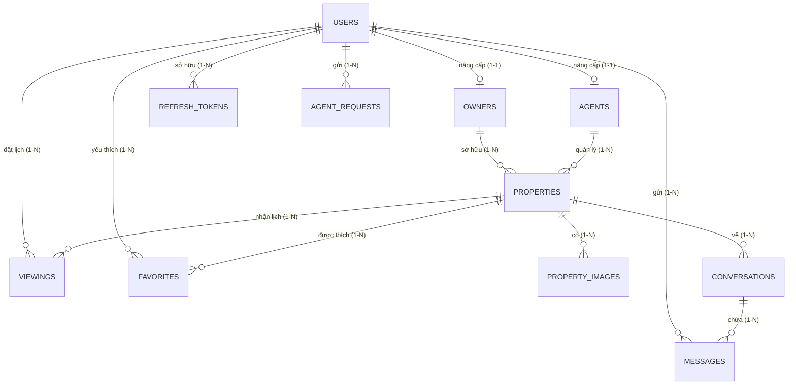

# BÁO CÁO DỰ ÁN

**XÂY DỰNG BACKEND API CHO NỀN TẢNG BẤT ĐỘNG SẢN VÀ CHO THUÊ NHÀ**

## CHƯƠNG 1. GIỚI THIỆU ĐỀ TÀI

### 1.1. Vấn đề chung
Trong bối cảnh thị trường bất động sản đang phát triển mạnh mẽ và sự lên ngôi của công nghệ số, việc tìm kiếm, mua bán và cho thuê nhà đất đang dần dịch chuyển sang các nền tảng trực tuyến. Tuy nhiên, nhiều nền tảng hiện nay vẫn còn hạn chế trong việc cung cấp một trải nghiệm liền mạch từ khâu tìm kiếm, liên hệ đến đặt lịch hẹn thực tế. Các vấn đề thường gặp bao gồm: thông tin bất động sản thiếu minh bạch, quy trình hẹn xem nhà chồng chéo, khó quản lý thời gian cho chủ nhà/môi giới và thiếu một kênh giao tiếp an toàn, bảo mật trực tiếp trên hệ thống.

### 1.2. Lý do chọn đề tài
Nhận thấy những bất cập trên, việc xây dựng một hệ thống backend API hiện đại, tập trung vào nghiệp vụ quản lý bất động sản và luồng đặt lịch xem nhà là vô cùng thiết thực. Đề tài "Xây dựng Backend API cho Nền tảng Bất động sản và Cho thuê nhà" được chọn nhằm tạo ra một giải pháp công nghệ số toàn diện, giúp kết nối người có nhu cầu (người mua/thuê) với người cung cấp (chủ nhà/môi giới) một cách nhanh chóng. 
Đồng thời, đồ án này cung cấp cơ hội áp dụng các công nghệ Backend tiên tiến (Spring Boot 4, PostgreSQL, JWT Authentication, API Design) vào việc giải quyết các bài toán về hiệu suất tìm kiếm, toàn vẹn dữ liệu giao dịch và bảo mật hệ thống.

### 1.3. Mục tiêu đề tài
Mục tiêu cốt lõi của đề tài là xây dựng một hệ thống backend cung cấp các RESTful API chuẩn mực phục vụ nền tảng quản lý bất động sản. Hệ thống cần đáp ứng các mục tiêu cụ thể sau:
- Quản lý tài khoản người dùng và phân quyền chi tiết (User, Owner, Agent, Admin).
- Quản lý vòng đời tin đăng bất động sản (Tạo mới, chờ duyệt, công khai, đã bán).
- Hỗ trợ công cụ tìm kiếm và lọc dữ liệu bất động sản mạnh mẽ.
- Số hóa toàn bộ quy trình đặt lịch xem nhà, giảm thiểu xung đột thời gian.
- Cung cấp tính năng nhắn tin nội bộ gắn với ngữ cảnh từng bất động sản.
- Đảm bảo tính bảo mật, hiệu suất cao và khả năng mở rộng trong tương lai.

### 1.4. Phạm vi đề tài
Trong phạm vi của đồ án, hệ thống được xây dựng dưới dạng backend RESTful API. Đối tượng sử dụng bao gồm: Khách hàng (User), Chủ nhà (Owner), Môi giới (Agent) và Quản trị viên (Admin).
Các chức năng được triển khai tập trung vào việc quản lý dữ liệu người dùng, quản lý tin đăng bất động sản, tích hợp lưu trữ hình ảnh Cloudinary, đặt lịch xem nhà, quản lý danh sách yêu thích và giao tiếp tin nhắn. Giới hạn đề tài không bao gồm việc tích hợp cổng thanh toán trực tiếp cho giao dịch mua bán nhà đất do tính phức tạp về mặt pháp lý.

---

## CHƯƠNG 2. CÔNG VIỆC CẦN LÀM

Để hoàn thành hệ thống, nhóm đã thực hiện các công việc cụ thể sau:

### 2.1. Phân tích và thiết kế hệ thống
- Khảo sát các nền tảng bất động sản thực tế để xác định yêu cầu nghiệp vụ.
- Thiết kế luồng người dùng cho các vai trò: Khách hàng, Chủ nhà, Môi giới, Quản trị viên.
- Xây dựng sơ đồ Use Case và thiết kế cơ sở dữ liệu cho toàn bộ hệ thống.

### 2.2. Thiết kế và xây dựng cơ sở dữ liệu
- Phân tích và thiết kế cấu trúc các bảng dữ liệu.
- Thiết lập các mối quan hệ và ràng buộc giữa các bảng để đảm bảo tính toàn vẹn dữ liệu.

### 2.3. Xây dựng chức năng xác thực và quản lý người dùng
- Xây dựng chức năng đăng ký tài khoản mới.
- Xây dựng chức năng đăng nhập và đăng xuất khỏi hệ thống.
- Hỗ trợ cơ chế duy trì trạng thái đăng nhập và tự động gia hạn phiên làm việc.
- Hỗ trợ xác thực tài khoản thông qua mã xác nhận gửi qua email.
- Xây dựng chức năng quên mật khẩu và đặt lại mật khẩu mới.
- Xây dựng chức năng khôi phục tài khoản đã bị vô hiệu hóa trước đó.
- Xây dựng chức năng xem và cập nhật thông tin hồ sơ cá nhân của người dùng.
- Xây dựng chức năng tự nâng cấp vai trò của bản thân lên Chủ nhà.
- Xây dựng quy trình gửi yêu cầu xét duyệt làm Môi giới gửi đến Quản trị viên.
- Xây dựng chức năng cho phép Quản trị viên quản lý danh sách người dùng, thay đổi vai trò trực tiếp, vô hiệu hóa hoặc khôi phục tài khoản người dùng.

### 2.4. Xây dựng chức năng quản lý bất động sản
- Xây dựng chức năng thêm mới, cập nhật và xóa thông tin tin đăng bất động sản.
- Xây dựng chức năng quản lý danh sách bất động sản cá nhân dành cho Chủ nhà và Môi giới.
- Xây dựng chức năng xem chi tiết tin đăng bất động sản.
- Xây dựng chức năng ẩn hoặc hiện tin đăng bất động sản.
- Xây dựng chức năng tải lên nhiều hình ảnh, thay thế hình ảnh cũ hoặc xóa hình ảnh của bất động sản.
- Xây dựng chức năng tìm kiếm, lọc bất động sản nâng cao theo nhiều tiêu chí (khu vực, giá cả, số phòng ngủ, số phòng tắm, trạng thái).
- Xây dựng chức năng gợi ý danh sách các bất động sản tương tự.
- Xây dựng quy trình kiểm duyệt tin đăng (phê duyệt hoặc từ chối kèm lý do) dành cho Quản trị viên.
- Xây dựng chức năng thống kê lượt xem và lượt yêu thích của bất động sản.

### 2.5. Xây dựng chức năng đặt lịch xem nhà
- Xây dựng chức năng đặt lịch xem nhà đối với một bất động sản cụ thể cho Khách hàng.
- Xây dựng chức năng kiểm tra và hiển thị các khung giờ còn trống trong ngày của bất động sản.
- Xây dựng chức năng xem danh sách, chi tiết lịch hẹn đã đặt và theo dõi trạng thái lịch hẹn của Khách hàng.
- Xây dựng chức năng quản lý danh sách lịch hẹn cần xử lý của Chủ nhà và Môi giới.
- Xây dựng chức năng phê duyệt, từ chối hoặc xác nhận hoàn thành lịch hẹn xem nhà.
- Hỗ trợ chức năng yêu cầu dời lịch hẹn sang thời gian khác.
- Xây dựng chức năng thống kê tổng số lượng lịch hẹn theo từng trạng thái.

### 2.6. Xây dựng chức năng danh sách yêu thích
- Xây dựng chức năng lưu và xóa bất động sản quan tâm khỏi danh sách yêu thích.
- Xây dựng chức năng xóa nhiều bất động sản hoặc xóa toàn bộ danh sách yêu thích cùng lúc.
- Xây dựng chức năng xem danh sách tất cả bất động sản đã lưu của cá nhân.
- Xây dựng chức năng kiểm tra nhanh trạng thái một bất động sản đã được lưu hay chưa.

### 2.7. Xây dựng chức năng hội thoại và nhắn tin
- Xây dựng chức năng khởi tạo hoặc truy cập cuộc hội thoại giữa người mua và người bán gắn liền với từng bất động sản cụ thể.
- Xây dựng chức năng xem danh sách và chi tiết cuộc hội thoại của cá nhân.
- Xây dựng chức năng tải và hiển thị lịch sử tin nhắn trong cuộc hội thoại.
- Xây dựng chức năng gửi và nhận tin nhắn trực tiếp thời gian thực.
- Hỗ trợ chức năng sửa nội dung tin nhắn và thu hồi tin nhắn đã gửi.
- Xây dựng chức năng đánh dấu cuộc hội thoại đã đọc.
- Xây dựng chức năng tính toán và cập nhật số lượng tin nhắn chưa đọc của người dùng.
- Xây dựng chức năng hiển thị trạng thái trực tuyến hoặc ngoại tuyến của người dùng.

### 2.8. Tài liệu hóa và kiểm thử hệ thống
- Xây dựng tài liệu hướng dẫn sử dụng và tương tác với các chức năng hệ thống.
- Viết các kịch bản kiểm thử tự động cho các nghiệp vụ cốt lõi để đảm bảo hệ thống chạy đúng.
- Thực hiện kiểm thử toàn bộ các luồng nghiệp vụ thực tế của hệ thống.

---

## CHƯƠNG 3. MÔ TẢ CHỨC NĂNG HỆ THỐNG (FUNCTIONAL REQUIREMENTS)

Chương này mô tả chi tiết các chức năng cốt lõi của hệ thống dưới góc nhìn nghiệp vụ phân tích hệ thống, tập trung vào hành vi tương tác của người dùng và các bước xử lý của hệ thống.

### 3.1. Chức năng đăng ký tài khoản (FR01)

Mô tả: Cho phép người dùng chưa có tài khoản thực hiện khai báo thông tin cá nhân và email để đăng ký tài khoản mới trên hệ thống.

Luồng hoạt động:
1. Người dùng nhập các thông tin đăng ký bao gồm: email, mật khẩu (password), họ tên (fullName) và số điện thoại (phone) trên giao diện đăng ký.
2. Hệ thống tiếp nhận thông tin và kiểm tra tính hợp lệ của định dạng email, độ dài mật khẩu (tối thiểu 6 ký tự).
3. Hệ thống kiểm tra sự tồn tại của địa chỉ email vừa nhập trong cơ sở dữ liệu.
4. Nếu địa chỉ email đã được sử dụng từ trước, hệ thống hiển thị thông báo lỗi và yêu cầu thay đổi thông tin.
5. Nếu dữ liệu hợp lệ, hệ thống tạo bản ghi người dùng mới trong cơ sở dữ liệu với vai trò mặc định ban đầu là Khách hàng (USER).
6. Hệ thống thiết lập trạng thái hoạt động của tài khoản là chưa kích hoạt (chờ xác thực).
7. Hệ thống tạo mã xác thực OTP ngẫu nhiên gồm 6 chữ số và lưu trữ tạm thời trong bộ nhớ đệm cùng thời gian hết hạn (5 phút).
8. Hệ thống gửi tự động email chứa mã OTP xác thực tới địa chỉ email của người dùng.
9. Hệ thống gửi thông báo đăng ký thông tin thành công và chuyển hướng người dùng sang giao diện nhập OTP kích hoạt.

Kết quả: Tài khoản người dùng được tạo thành công ở trạng thái chờ kích hoạt và mã OTP được gửi tới email của người dùng.

---

### 3.2. Chức năng xác thực kích hoạt tài khoản bằng OTP (FR02)

Mô tả: Xác minh địa chỉ email của người dùng thông qua mã OTP để kích hoạt tài khoản sang trạng thái hoạt động chính thức trên hệ thống.

Luồng hoạt động:
1. Người dùng lấy mã OTP được cấp từ email cá nhân và nhập vào màn hình xác thực tài khoản, hoặc chọn yêu cầu gửi lại OTP mới.
2. Nếu chọn gửi lại OTP, hệ thống kiểm tra giới hạn tần suất gửi (Rate Limiting - tối đa 5 lần gửi / 1 giờ cho 1 email).
3. Hệ thống tạo mã OTP mới trong bộ nhớ đệm, ghi đè mã cũ và gửi email chứa mã OTP mới cho người dùng.
4. Khi nhận được mã OTP từ người dùng gửi lên, hệ thống tiếp nhận địa chỉ email và mã OTP cần xác thực.
5. Hệ thống kiểm tra sự tồn tại và thời hạn hiệu lực của mã OTP trong bộ nhớ tạm thời.
6. Nếu mã OTP sai hoặc đã hết hạn, hệ thống trả về thông báo lỗi và yêu cầu nhập lại hoặc gửi lại mã.
7. Nếu mã OTP trùng khớp hoàn toàn, hệ thống cập nhật trạng thái hoạt động của tài khoản người dùng thành đã kích hoạt.
8. Hệ thống thực hiện giải phóng và xóa bỏ mã OTP này khỏi bộ nhớ tạm thời.
9. Hệ thống cấp Access Token và Refresh Token cho người dùng và hiển thị thông báo xác thực thành công.

Kết quả: Tài khoản người dùng được kích hoạt thành công sang trạng thái hoạt động và người dùng nhận được token truy cập.

---

### 3.3. Chức năng đăng nhập (FR03)

Mô tả: Xác thực thông tin tài khoản và mật khẩu của người dùng để cấp quyền truy cập vào các tính năng của hệ thống.

Luồng hoạt động:
1. Người dùng nhập địa chỉ email và mật khẩu tại giao diện đăng nhập.
2. Hệ thống kiểm tra giới hạn số lần đăng nhập sai (tối đa 10 lần đăng nhập thất bại trong vòng 15 phút) để bảo mật tài khoản.
3. Hệ thống thực hiện truy vấn thông tin tài khoản người dùng từ cơ sở dữ liệu dựa trên email cung cấp.
4. Nếu không tìm thấy người dùng, hệ thống trả về thông báo lỗi thông tin đăng nhập không chính xác.
5. Hệ thống kiểm tra trạng thái hoạt động của tài khoản; nếu tài khoản đang bị vô hiệu hóa hoặc đã xóa mềm, hệ thống từ chối đăng nhập.
6. Hệ thống thực hiện giải mã và so sánh mật khẩu người dùng nhập với mật khẩu đã được mã hóa lưu trong cơ sở dữ liệu.
7. Nếu mật khẩu không khớp, hệ thống ghi nhận một lần đăng nhập sai và trả về thông báo lỗi thông tin đăng nhập không chính xác.
8. Nếu mật khẩu trùng khớp, hệ thống khởi tạo phiên làm việc mới cho người dùng.
9. Hệ thống tạo Access Token (hiệu lực trong 1 giờ) và Refresh Token chứa các thông tin phân quyền tương ứng.
10. Hệ thống trả về Access Token, Refresh Token cùng thông tin tài khoản cơ bản và thông báo đăng nhập thành công.

Kết quả: Người dùng đăng nhập thành công vào hệ thống và được cấp các token truy cập hợp lệ.

---

### 3.4. Chức năng đăng xuất (FR04)

Mô tả: Hủy bỏ phiên làm việc hiện tại của người dùng và vô hiệu hóa các token đã được cấp.

Luồng hoạt động:
1. Người dùng bấm chọn nút Đăng xuất trên giao diện ứng dụng.
2. Hệ thống tiếp nhận yêu cầu đăng xuất kèm theo Access Token hiện tại trong header Authorization.
3. Hệ thống giải mã Access Token để xác định danh tính và Refresh Token tương ứng của phiên làm việc.
4. Hệ thống thực hiện xóa bỏ Refresh Token đó khỏi cơ sở dữ liệu để ngăn ngừa việc lạm dụng làm mới token.
5. Hệ thống yêu cầu ứng dụng phía người dùng xóa bỏ Access Token khỏi bộ nhớ.
6. Hệ thống cập nhật trạng thái hoạt động của người dùng thành ngoại tuyến.
7. Hệ thống gửi thông báo đăng xuất thành công và chuyển hướng người dùng về trang chủ của hệ thống.

Kết quả: Phiên làm việc của người dùng kết thúc thành công, các token đã cấp bị vô hiệu hóa hoàn toàn.

---

### 3.5. Chức năng làm mới phiên đăng nhập (FR05)

Mô tả: Tự động cấp lại Access Token mới khi Access Token cũ hết hạn dựa trên Refresh Token hợp lệ mà không cần người dùng đăng nhập lại.

Luồng hoạt động:
1. Ứng dụng khách gửi yêu cầu làm mới phiên làm việc kèm theo Refresh Token được lưu trữ.
2. Hệ thống tiếp nhận Refresh Token và giải mã để kiểm tra chữ ký bảo mật.
3. Hệ thống truy vấn Refresh Token trong cơ sở dữ liệu để đối chiếu tính hoạt động.
4. Nếu Refresh Token không tồn tại hoặc đã bị thu hồi (đăng xuất), hệ thống trả về lỗi và yêu cầu người dùng đăng nhập lại thủ công.
5. Hệ thống đối chiếu thời gian hết hạn của Refresh Token; nếu quá hạn, hệ thống trả về thông báo lỗi phiên làm việc đã kết thúc.
6. Nếu hợp lệ, hệ thống lấy thông tin tài khoản người dùng liên kết với Refresh Token đó.
7. Hệ thống tạo mới Access Token và Refresh Token mới để thay thế token cũ.
8. Hệ thống cập nhật Refresh Token mới vào cơ sở dữ liệu và xóa Refresh Token cũ.
9. Hệ thống phản hồi cặp Access Token và Refresh Token mới về cho ứng dụng khách.

Kết quả: Phiên làm việc của người dùng được duy trì liên tục và Access Token mới được cấp thành công.

---

### 3.6. Chức năng quản lý hồ sơ cá nhân (FR06)

Mô tả: Cho phép người dùng xem thông tin cá nhân, cập nhật thông tin liên hệ và thực hiện quy trình đặt lại mật khẩu khi bị quên.

#### 3.6.1. Xem và cập nhật thông tin hồ sơ
Luồng hoạt động:
1. Người dùng chọn mục thông tin cá nhân trên giao diện quản lý tài khoản.
2. Hệ thống xác thực Access Token và truy xuất thông tin người dùng từ cơ sở dữ liệu bao gồm: họ tên (fullName), email, số điện thoại (phone) và vai trò (role).
3. Hệ thống hiển thị các thông tin hồ sơ lên giao diện màn hình.
4. Người dùng chỉnh sửa các thông tin: họ tên (fullName), số điện thoại (phone) và bấm Xác nhận.
5. Hệ thống kiểm tra tính hợp lệ của dữ liệu.
6. Hệ thống thực hiện cập nhật các thay đổi vào cơ sở dữ liệu người dùng.
7. Hệ thống phản hồi thông báo cập nhật hồ sơ thành công và trả về thông tin người dùng mới.

Kết quả: Hồ sơ cá nhân của người dùng được cập nhật mới thành công trên hệ thống.

#### 3.6.2. Quên mật khẩu và đặt lại mật khẩu
Luồng hoạt động:
1. Người dùng chọn tính năng quên mật khẩu trên giao diện đăng nhập và nhập địa chỉ email tài khoản.
2. Hệ thống kiểm tra sự tồn tại của email trong cơ sở dữ liệu; nếu không có, trả về thông báo lỗi email chưa đăng ký.
3. Nếu hợp lệ, hệ thống tạo mã OTP khôi phục mật khẩu gửi qua email và hiển thị giao diện nhập mã OTP.
4. Người dùng nhập mã OTP nhận được cùng mật khẩu mới muốn thiết lập.
5. Hệ thống kiểm tra mã OTP; nếu sai hoặc quá hạn, hệ thống báo lỗi và cho phép nhập lại.
6. Nếu OTP chính xác, hệ thống tiến hành mã hóa mật khẩu mới và cập nhật mật khẩu mới vào cơ sở dữ liệu.
7. Hệ thống xóa mã OTP khôi phục trong bộ nhớ đệm và hiển thị thông báo đặt lại mật khẩu thành công.

Kết quả: Mật khẩu của người dùng được đặt lại thành công và có thể sử dụng để đăng nhập lại hệ thống.

---

### 3.7. Chức năng quản trị tài khoản người dùng (FR07)

Mô tả: Cho phép Quản trị viên tra cứu danh sách người dùng, thực hiện xóa tài khoản vi phạm chính sách hoặc khôi phục lại trạng thái hoạt động.

Luồng hoạt động:
1. Quản trị viên truy cập vào giao diện quản lý tài khoản người dùng.
2. Hệ thống xác thực quyền Quản trị viên (ADMIN) của tài khoản hiện tại qua Access Token.
3. Quản trị viên nhập từ khóa tìm kiếm (keyword) theo họ tên hoặc email và thiết lập các thông số phân trang.
4. Hệ thống thực hiện tìm kiếm và phân trang danh sách người dùng từ cơ sở dữ liệu.
5. Hệ thống hiển thị danh sách người dùng kèm theo trạng thái tài khoản hoạt động hay vô hiệu hóa.
6. Quản trị viên chọn một tài khoản người dùng vi phạm quy định sử dụng và nhấn nút Vô hiệu hóa/Xóa tài khoản (Soft Delete).
7. Hệ thống thực hiện vô hiệu hóa tài khoản bằng cách đặt cờ trạng thái xóa mềm trong cơ sở dữ liệu, đồng thời thu hồi mọi token đăng nhập của người dùng đó.
8. Khi cần khôi phục, Quản trị viên chọn tài khoản đó và nhấn nút Khôi phục tài khoản; hệ thống khôi phục trạng thái hoạt động bình thường cho tài khoản.
9. Hệ thống gửi thông báo thao tác thành công và làm mới giao diện danh sách người dùng.

Kết quả: Trạng thái tài khoản người dùng được cập nhật thay đổi thành công theo thao tác của Quản trị viên.

---

### 3.8. Chức năng yêu cầu nâng cấp vai trò người dùng (FR08)

Mô tả: Cho phép Khách hàng tự nâng cấp trực tiếp thành Chủ nhà, gửi đơn làm Môi giới, và cho phép Quản trị viên xét duyệt đơn nâng cấp Môi giới.

#### 3.8.1. Yêu cầu nâng cấp lên Chủ nhà và gửi đơn làm Môi giới
Luồng hoạt động:
1. Người dùng truy cập trang nâng cấp vai trò tài khoản trên giao diện cá nhân.
2. Nếu nâng cấp lên Chủ nhà (Owner), người dùng chọn Xác nhận nâng cấp; hệ thống tự động cập nhật vai trò tài khoản thành OWNER trong cơ sở dữ liệu mà không cần thông qua bước phê duyệt của Quản trị viên.
3. Nếu muốn nâng cấp lên Môi giới (Agent), người dùng nhập nội dung đơn đăng ký (content - trình bày kinh nghiệm/hồ sơ) tại form đăng ký.
4. Hệ thống tiếp nhận yêu cầu và kiểm tra xem người dùng có đơn nâng cấp Môi giới nào đang ở trạng thái chờ duyệt (PENDING) hay không.
5. Nếu chưa có đơn nào chờ duyệt, hệ thống tạo bản ghi yêu cầu nâng cấp mới ở trạng thái chờ duyệt (PENDING) kèm mốc thời gian gửi.
6. Hệ thống gửi thông báo gửi đơn thành công và xếp đơn này vào danh sách chờ xét duyệt của Quản trị viên.

Kết quả: Tài khoản được nâng cấp trực tiếp thành Chủ nhà hoặc đơn xin làm Môi giới được gửi thành công lên hàng chờ phê duyệt.

#### 3.8.2. Xét duyệt yêu cầu làm Môi giới (Quản trị viên)
Luồng hoạt động:
1. Quản trị viên truy cập danh sách các yêu cầu làm môi giới đang chờ xử lý (status=PENDING).
2. Hệ thống hiển thị chi tiết nội dung đơn yêu cầu và thông tin người dùng gửi đơn.
3. Quản trị viên bấm Chấp thuận hoặc Từ chối yêu cầu.
4. Nếu chấp thuận, hệ thống cập nhật trạng thái yêu cầu thành APPROVED và tự động chuyển đổi vai trò người dùng từ USER thành AGENT trong bảng dữ liệu người dùng.
5. Nếu từ chối, Quản trị viên nhập lý do từ chối cụ thể; hệ thống cập nhật trạng thái yêu cầu thành REJECTED và lưu lý do từ chối.
6. Hệ thống phản hồi kết quả và cập nhật giao diện quản trị cho Quản trị viên.

Kết quả: Yêu cầu nâng cấp môi giới được cập nhật trạng thái duyệt và quyền hạn người dùng được cập nhật tương ứng.

---

### 3.9. Chức năng quản lý tin đăng bất động sản (FR09)

Mô tả: Cho phép Chủ nhà và Môi giới đăng tin, cập nhật, xóa mềm bất động sản, quản lý các hình ảnh thực tế và theo dõi số liệu thống kê lượt xem; hỗ trợ Quản trị viên phê duyệt bài đăng.

#### 3.9.1. Đăng tin, cập nhật và xóa tin đăng
Luồng hoạt động:
1. Người bán điền đầy đủ thông tin bất động sản bao gồm: Tiêu đề tin (title), Mô tả chi tiết (description), Giá (price), Diện tích (area), Số phòng ngủ (bedrooms), Số phòng tắm (bathrooms), Địa chỉ (address), Tỉnh/Thành phố (city), Quận/Huyện (district) và mã môi giới quản lý (agentId, nếu có).
2. Hệ thống tiếp nhận thông tin và kiểm tra tính hợp lệ của dữ liệu đầu vào.
3. Hệ thống tạo bản ghi bất động sản mới trong cơ sở dữ liệu với trạng thái mặc định ban đầu là chờ phê duyệt (PENDING) và cờ hiển thị là ẩn.
4. Khi cập nhật thông tin bất động sản, người bán chỉnh sửa các trường thông tin; hệ thống cập nhật các trường thay đổi và tự động reset trạng thái tin đăng về chờ phê duyệt (PENDING).
5. Khi xóa bất động sản, người bán chọn xóa tin; hệ thống thực hiện xóa mềm bằng cách đặt cờ trạng thái xóa thành có trong cơ sở dữ liệu để ẩn khỏi giao diện.
6. Hệ thống gửi thông báo thao tác tin đăng thành công về giao diện người bán.

Kết quả: Tin đăng bất động sản được tạo mới, cập nhật thông tin hoặc xóa mềm thành công trên hệ thống.

#### 3.9.2. Quản lý hình ảnh và xem thống kê tương tác
Luồng hoạt động:
1. Người bán chọn tính năng quản lý hình ảnh của một tin đăng bất động sản cá nhân.
2. Hệ thống hiển thị danh sách hình ảnh hiện tại của bất động sản.
3. Người bán thực hiện tải lên các tệp ảnh mới, thay thế hình ảnh cũ hoặc xóa bỏ ảnh.
4. Hệ thống tải ảnh mới lên máy chủ đám mây, lưu đường dẫn mới và cập nhật liên kết hình ảnh vào cơ sở dữ liệu.
5. Khi người bán chọn xem thống kê (Analytics) của tin đăng, hệ thống truy vấn dữ liệu hoạt động.
6. Hệ thống tính toán và hiển thị các chỉ số bao gồm: số lượt xem (viewCount), số lượng lịch hẹn xem nhà (viewingAppointments), tổng số cuộc hội thoại chat (totalConversations) và tỷ lệ chuyển đổi.

Kết quả: Hình ảnh bất động sản được cập nhật và các chỉ số thống kê tương tác được hiển thị trực quan cho người bán.

#### 3.9.3. Kiểm duyệt tin đăng bất động sản (Quản trị viên)
Luồng hoạt động:
1. Quản trị viên truy cập danh sách các tin đăng bất động sản đang chờ kiểm duyệt (PENDING) trên trang quản trị.
2. Quản trị viên xem chi tiết các thông tin, địa chỉ và hình ảnh đính kèm của tin đăng.
3. Quản trị viên nhấn nút Phê duyệt hoặc Từ chối tin đăng.
4. Nếu phê duyệt, hệ thống cập nhật trạng thái tin thành APPROVED và bật cờ hiển thị công khai thành hoạt động.
5. Nếu từ chối, Quản trị viên nhập lý do từ chối; hệ thống cập nhật trạng thái tin thành REJECTED và lưu lý do.
6. Hệ thống lưu kết quả kiểm duyệt và phản hồi thông báo thành công cho Quản trị viên.

Kết quả: Trạng thái của tin đăng bất động sản được cập nhật phê duyệt để công khai hoặc bị từ chối.

---

### 3.10. Chức năng tìm kiếm và lọc bất động sản (FR10)

Mô tả: Cho phép khách hàng tìm kiếm, lọc danh sách bất động sản đã được duyệt và xem chi tiết thông tin kèm danh sách gợi ý bất động sản tương đồng.

Luồng hoạt động:
1. Người dùng nhập từ khóa tìm kiếm (search - tìm theo tiêu đề/mô tả) và lựa chọn các tiêu chí lọc bao gồm: thành phố (city), quận/huyện (district), mức giá tối thiểu (minPrice), mức giá tối đa (maxPrice), số phòng ngủ (bedrooms), số phòng tắm (bathrooms).
2. Người dùng thiết lập chỉ mục trang hiển thị (page) và số lượng kết quả mỗi trang (size).
3. Hệ thống tiếp nhận yêu cầu và xây dựng câu lệnh truy vấn động kết hợp các tham số lọc cùng điều kiện tin đăng phải ở trạng thái APPROVED và cờ hiển thị là hoạt động.
4. Hệ thống thực hiện truy vấn cơ sở dữ liệu và lấy ra danh sách bất động sản phù hợp.
5. Hệ thống trả về danh sách bất động sản phân trang lên màn hình cho người dùng.
6. Khi người dùng click vào một bất động sản cụ thể, hệ thống sử dụng đường dẫn tĩnh (slug) để truy vấn toàn bộ thông tin chi tiết bao gồm thông tin chủ nhà/môi giới và danh sách hình ảnh.
7. Hệ thống tự động tăng lượt xem tin đăng (viewCount) lên 1 đơn vị trong cơ sở dữ liệu.
8. Hệ thống phân tích loại hình, khu vực và mức giá của bất động sản hiện tại để truy vấn tìm kiếm các bất động sản tương tự và hiển thị thành danh mục gợi ý ở cuối trang chi tiết.

Kết quả: Danh sách bất động sản lọc phân trang và thông tin chi tiết tin đăng được hiển thị thành công cho người dùng.

---

### 3.11. Chức năng quản lý bất động sản yêu thích (FR11)

Mô tả: Cho phép khách hàng lưu lại các bất động sản quan tâm và quản lý danh sách yêu thích cá nhân hoặc thực hiện xóa hàng loạt tin đã lưu.

Luồng hoạt động:
1. Khách hàng nhấn nút yêu thích tin đăng bất động sản trên giao diện chi tiết hoặc danh sách.
2. Hệ thống xác thực Access Token và kiểm tra xem bất động sản đã được khách hàng này lưu trước đó chưa.
3. Nếu chưa lưu, hệ thống tạo bản ghi liên kết yêu thích mới trong cơ sở dữ liệu và phản hồi thông báo đã lưu tin đăng.
4. Nếu bất động sản đã được lưu từ trước, hệ thống tiến hành xóa bỏ liên kết yêu thích đó và thông báo đã hủy lưu tin.
5. Khi khách hàng truy cập giao diện danh sách yêu thích, hệ thống truy vấn toàn bộ các bản ghi bất động sản được khách hàng lưu và hiển thị danh sách phân trang.
6. Khi khách hàng muốn dọn dẹp danh sách, họ chọn nhiều bất động sản và nhấn Xóa hàng loạt (Bulk Delete).
7. Hệ thống tiếp nhận danh sách mã định danh bất động sản và thực hiện xóa các bản ghi liên kết yêu thích tương ứng khỏi cơ sở dữ liệu.
8. Hệ thống làm mới giao diện hiển thị danh sách yêu thích của khách hàng.

Kết quả: Danh sách yêu thích của khách hàng được cập nhật, hiển thị và thực hiện xóa các mục thành công.

---

### 3.12. Chức năng đặt lịch xem nhà (FR12)

Mô tả: Cho phép khách hàng chọn thời gian đặt hẹn gặp trực tiếp tại địa điểm bất động sản để khảo sát thực tế và dời thời gian hẹn khi cần.

Luồng hoạt động:
1. Khách hàng bấm chọn Đặt lịch xem tại trang chi tiết bất động sản.
2. Khách hàng nhập ngày giờ muốn hẹn gặp (viewingDate) và nhập nội dung ghi chú (note).
3. Hệ thống kiểm tra tính hợp lệ của thời gian hẹn gặp: thời gian hẹn phải nằm ở tương lai và cách thời điểm hiện tại ít nhất 1 giờ.
4. Hệ thống kiểm tra tính công khai và trạng thái hoạt động của tin đăng bất động sản.
5. Nếu hợp lệ, hệ thống tạo bản ghi lịch hẹn xem nhà mới ở trạng thái chờ phê duyệt (PENDING) trong cơ sở dữ liệu.
6. Hệ thống tự động gửi tín hiệu thông báo lịch hẹn mới đến tài khoản Chủ nhà hoặc Môi giới quản lý tin đăng.
7. Khi khách hàng muốn thay đổi thời gian, họ chọn lịch hẹn từ danh sách cá nhân và sử dụng tính năng Dời lịch hẹn (Reschedule) để nhập thời gian hẹn mới (newViewingDate).
8. Hệ thống kiểm tra lại ràng buộc thời gian tương lai, cập nhật ngày hẹn mới vào bản ghi lịch hẹn và tự động đưa trạng thái lịch hẹn quay về chờ phê duyệt (PENDING) để người bán duyệt lại.

Kết quả: Lịch hẹn xem nhà được tạo mới hoặc dời thời gian thành công và chuyển đến người bán xử lý.

---

### 3.13. Chức năng quản lý lịch hẹn xem nhà (FR13)

Mô tả: Cho phép người bán xem danh sách lịch hẹn của khách hàng đặt và thực hiện phê duyệt, từ chối hoặc xác nhận kết quả hoàn thành buổi hẹn.

Luồng hoạt động:
1. Người bán (Chủ nhà hoặc Môi giới) truy cập vào giao diện quản lý lịch hẹn dành cho người bán.
2. Hệ thống xác thực quyền của người bán thông qua Access Token và lấy danh sách các lịch hẹn liên quan đến bất động sản thuộc quyền quản lý của họ.
3. Hệ thống hiển thị các lịch hẹn phân loại theo các danh mục trạng thái: PENDING, CONFIRMED, CANCELLED, COMPLETED.
4. Người bán chọn một lịch hẹn đang chờ duyệt (PENDING) và nhấn nút Phê duyệt hoặc Từ chối.
5. Nếu phê duyệt, hệ thống cập nhật trạng thái lịch hẹn thành CONFIRMED.
6. Nếu từ chối, người bán nhập lý do; hệ thống cập nhật trạng thái lịch hẹn thành CANCELLED và lưu lý do từ chối.
7. Sau khi diễn ra buổi hẹn xem nhà thực tế, người bán nhấn Xác nhận hoàn thành; hệ thống cập nhật trạng thái lịch hẹn thành COMPLETED trong cơ sở dữ liệu.
8. Hệ thống gửi thông báo thay đổi trạng thái lịch hẹn về phía tài khoản khách hàng và làm mới giao diện hiển thị cho người bán.

Kết quả: Trạng thái lịch hẹn được cập nhật chính xác và khách hàng nhận được thông báo phản hồi của người bán.

---

### 3.14. Chức năng trò chuyện và nhắn tin trực tuyến (FR14)

Mô tả: Cung cấp kênh chat trực tiếp giữa khách hàng và người bán gắn liền với từng tin đăng bất động sản cụ thể, hỗ trợ sửa đổi và thu hồi tin nhắn.

Luồng hoạt động:
1. Khách hàng nhấn biểu tượng chat tại trang bất động sản; hệ thống kiểm tra và lấy cuộc hội thoại (conversation) đã có giữa khách hàng và người bán trên bất động sản này, nếu chưa có thì khởi tạo mới bản ghi cuộc hội thoại.
2. Hệ thống tải danh sách các cuộc hội thoại hiện có của người dùng kèm thời gian tin nhắn cuối cùng để hiển thị lên hộp thư trò chuyện.
3. Khi người dùng mở một cuộc hội thoại cụ thể, hệ thống tải lịch sử tin nhắn của cuộc hội thoại đó (phân trang để hiển thị).
4. Người dùng nhập nội dung tin nhắn dạng văn bản và nhấn Gửi.
5. Hệ thống tiếp nhận nội dung, lưu tin nhắn mới vào cơ sở dữ liệu ở trạng thái chưa đọc và gửi tin nhắn thời gian thực qua kết nối WebSocket tới thiết bị người nhận.
6. Khi người gửi muốn thay đổi nội dung, họ chọn tin nhắn đã gửi và nhấn Sửa tin nhắn (nhập nội dung mới) hoặc nhấn Thu hồi tin nhắn.
7. Hệ thống cập nhật nội dung mới (và cờ đã sửa) hoặc đặt cờ đã thu hồi (isRecalled) thành có trong cơ sở dữ liệu đối với tin nhắn tương ứng.
8. Hệ thống đồng bộ sự thay đổi nội dung hoặc trạng thái thu hồi của tin nhắn qua WebSocket tới thiết bị của người nhận đang trực tuyến.

Kết quả: Cuộc hội thoại được thiết lập, tin nhắn được gửi, nhận, sửa hoặc thu hồi trực tiếp theo thời gian thực giữa hai bên.

---

### 3.15. Chức năng theo dõi trạng thái trực tuyến (FR15)

Mô tả: Theo dõi trạng thái kết nối trực tuyến của người dùng trên hệ thống và đồng bộ trạng thái đọc tin nhắn trong cuộc hội thoại.

Luồng hoạt động:
1. Khi người dùng thiết lập kết nối WebSocket tới máy chủ, hệ thống tự động ghi nhận trạng thái kết nối trực tuyến (isOnline = true) dựa trên tài khoản người dùng và lưu mốc thời gian hoạt động cuối cùng.
2. Hệ thống gửi sự kiện thay đổi trạng thái trực tuyến của người dùng này tới tất cả người dùng khác đang có cuộc hội thoại chung.
3. Khi người dùng ngắt kết nối WebSocket, hệ thống ghi nhận trạng thái ngoại tuyến (isOnline = false) và cập nhật thời gian hoạt động cuối cùng (lastSeenAt).
4. Người dùng có thể gửi yêu cầu HTTP để kiểm tra nhanh trạng thái trực tuyến của một người dùng cụ thể mà không cần mở kết nối WebSocket liên tục.
5. Khi một người dùng mở xem cuộc hội thoại, hệ thống tự động cập nhật cờ đã đọc (isRead = true) cho tất cả tin nhắn nhận được trong cuộc hội thoại đó và đồng bộ trạng thái đã đọc này qua WebSocket tới người gửi.
6. Hệ thống tự động tính toán lại số lượng tin nhắn chưa đọc và cập nhật chỉ số unread trên giao diện người dùng.

Kết quả: Trạng thái kết nối trực tuyến được cập nhật thời gian thực và trạng thái đọc tin nhắn được đồng bộ chính xác.

---

## CHƯƠNG 4. MÔ TẢ USE CASE

Chương này phân tích và đặc tả chi tiết các Use Case của hệ thống, chuẩn hóa các Actor và xây dựng ma trận mối quan hệ, bảng truy vết yêu cầu phần mềm dựa trên thực tế source code và cơ sở dữ liệu.

### 4.1. Xác định Actor

Hệ thống được xác định có 5 Actor chính tương ứng với các nhóm người dùng và quyền truy cập thực tế trong hệ thống:

1.  **Khách vãng lai (Guest)**: Người dùng chưa thực hiện đăng nhập vào hệ thống. Chỉ có quyền thực hiện các thao tác công khai như đăng ký tài khoản, đăng nhập, khôi phục mật khẩu, tìm kiếm và xem tin đăng bất động sản.
2.  **Khách hàng (User)**: Người dùng đã đăng nhập vào tài khoản cá nhân. Có quyền chỉnh sửa thông tin cá nhân, lưu tin đăng yêu thích, gửi tin nhắn trao đổi, đặt lịch hẹn và dời lịch hẹn xem nhà.
3.  **Chủ nhà (Owner)**: Người dùng có vai trò là Chủ sở hữu bất động sản. Thừa hưởng mọi quyền hạn của Khách hàng, đồng thời có quyền tạo bài đăng, chỉnh sửa tin đăng, quản lý hình ảnh bất động sản thuộc quyền sở hữu của mình và duyệt/từ chối lịch hẹn xem nhà từ khách hàng.
4.  **Môi giới (Agent)**: Người dùng được ủy quyền quản lý tin đăng bất động sản. Thừa hưởng mọi quyền hạn của Khách hàng, có quyền đăng tin, quản lý tin đăng bất động sản được phân công quản lý và đại diện chủ nhà duyệt/từ chối các lịch hẹn xem nhà.
5.  **Quản trị viên (Admin)**: Người có quyền hạn cao nhất trong hệ thống quản trị. Có nhiệm vụ kiểm duyệt các tin đăng bất động sản, xét duyệt yêu cầu nâng cấp vai trò của người dùng, tìm kiếm và vô hiệu hóa tài khoản người dùng vi phạm quy định.

---

### 4.2. Danh sách Use Case tổng hợp và phân rã

Dưới đây là danh sách các Use Case tổng hợp (macro use cases) và sơ đồ phân rã chi tiết thành các Use Case con (sub-use cases) để đảm bảo tính độc lập và tường minh của chức năng hệ thống:

#### 4.2.1. Nhóm Quản lý Xác thực và Tài khoản (Authentication & Account Management)
*   **UC_Auth: Quản lý xác thực và tài khoản (Use Case Tổng hợp)**
    *   *UC01: Đăng ký tài khoản mới* (Actor: Guest)
    *   *UC02: Xác thực kích hoạt tài khoản bằng OTP* (Actor: Guest)
    *   *UC03: Gửi lại mã OTP kích hoạt* (Actor: Guest)
    *   *UC04: Đăng nhập* (Actor: Guest)
    *   *UC05: Đăng xuất* (Actor: User)
    *   *UC06: Làm mới phiên đăng nhập* (Actor: User)
    *   *UC07: Yêu cầu khôi phục tài khoản đã xóa* (Actor: Guest)
    *   *UC08: Khôi phục tài khoản bằng OTP* (Actor: Guest)
    *   *UC09: Thu hồi phiên đăng nhập của người dùng* (Actor: Admin)

#### 4.2.2. Nhóm Khôi phục mật khẩu (Password Recovery)
*   **UC_Password: Khôi phục mật khẩu (Use Case Tổng hợp)**
    *   *UC10: Gửi yêu cầu khôi phục mật khẩu* (Actor: Guest)
    *   *UC11: Xác thực mã OTP quên mật khẩu* (Actor: Guest)
    *   *UC12: Đặt lại mật khẩu mới* (Actor: Guest)

#### 4.2.3. Nhóm Quản lý Hồ sơ cá nhân và Vai trò (Profile & Role Management)
*   **UC_Profile: Quản lý hồ sơ và vai trò (Use Case Tổng hợp)**
    *   *UC13: Xem hồ sơ cá nhân* (Actor: User)
    *   *UC14: Cập nhật thông tin hồ sơ cá nhân* (Actor: User)
    *   *UC15: Tự nâng cấp lên Chủ nhà* (Actor: User)
    *   *UC16: Gửi yêu cầu nâng cấp lên Môi giới* (Actor: User)
    *   *UC17: Xem danh sách đơn đăng ký Môi giới* (Actor: Admin)
    *   *UC18: Phê duyệt yêu cầu nâng cấp Môi giới* (Actor: Admin)
    *   *UC19: Từ chối yêu cầu nâng cấp Môi giới* (Actor: Admin)

#### 4.2.4. Nhóm Quản trị người dùng (User Administration)
*   **UC_AdminUser: Quản lý người dùng hệ thống (Use Case Tổng hợp)**
    *   *UC20: Tìm kiếm tài khoản người dùng* (Actor: Admin)
    *   *UC21: Vô hiệu hóa tài khoản người dùng* (Actor: Admin)

#### 4.2.5. Nhóm Quản lý Tin đăng bất động sản (Property Listing Management)
*   **UC_PropertyOwner: Quản lý tin đăng bất động sản (Use Case Tổng hợp)**
    *   *UC22: Tạo tin đăng bất động sản mới* (Actor: Owner, Agent)
    *   *UC23: Cập nhật thông tin tin đăng bất động sản* (Actor: Owner, Agent)
    *   *UC24: Xóa tin đăng bất động sản* (Actor: Owner, Agent)
    *   *UC25: Xem danh sách tin đăng cá nhân* (Actor: Owner, Agent)
    *   *UC26: Tải lên hình ảnh bất động sản* (Actor: Owner, Agent)
    *   *UC27: Xóa hình ảnh bất động sản* (Actor: Owner, Agent)
    *   *UC28: Xem thống kê hiệu suất tin đăng* (Actor: Owner, Agent)

#### 4.2.6. Nhóm Tìm kiếm và Tương tác bất động sản (Property Discovery & Favorites)
*   **UC_PropertyBrowse: Tìm kiếm và tương tác bất động sản (Use Case Tổng hợp)**
    *   *UC29: Tìm kiếm và lọc bất động sản* (Actor: Guest, User)
    *   *UC30: Xem chi tiết bất động sản* (Actor: Guest, User)
    *   *UC31: Xem danh sách bất động sản tương tự/liên quan* (Actor: Guest, User)
    *   *UC32: Lưu bất động sản yêu thích* (Actor: User)
    *   *UC33: Xem danh sách bất động sản yêu thích* (Actor: User)
    *   *UC34: Xóa bất động sản yêu thích* (Actor: User)

#### 4.2.7. Nhóm Kiểm duyệt tin đăng (Moderation Management)
*   **UC_PropertyMod: Kiểm duyệt tin đăng bất động sản (Use Case Tổng hợp)**
    *   *UC35: Phê duyệt hiển thị tin đăng* (Actor: Admin)
    *   *UC36: Từ chối hiển thị tin đăng* (Actor: Admin)

#### 4.2.8. Nhóm Đặt lịch hẹn xem nhà (Viewing Appointment Management)
*   **UC_Viewing: Quản lý lịch hẹn xem nhà (Use Case Tổng hợp)**
    *   *UC37: Đăng ký đặt lịch hẹn xem nhà* (Actor: User)
    *   *UC38: Yêu cầu dời lịch hẹn xem nhà* (Actor: User)
    *   *UC39: Xem danh sách lịch hẹn cá nhân* (Actor: User)
    *   *UC40: Cập nhật trạng thái lịch hẹn xem nhà* (Actor: Owner, Agent)

#### 4.2.9. Nhóm Trò chuyện và Nhắn tin (Communication & Real-time Presence)
*   **UC_Chat: Trò chuyện và theo dõi trạng thái trực tuyến (Use Case Tổng hợp)**
    *   *UC41: Khởi tạo cuộc hội thoại* (Actor: User)
    *   *UC42: Xem danh sách các cuộc hội thoại* (Actor: User)
    *   *UC43: Xem lịch sử tin nhắn trong cuộc trò chuyện* (Actor: User)
    *   *UC44: Gửi tin nhắn trực tuyến* (Actor: User)
    *   *UC45: Kiểm tra trạng thái hoạt động trực tuyến* (Actor: User)

---

### 4.3. Ma trận Actor – Use Case

Dưới đây là bảng ma trận phân quyền thể hiện mối quan hệ tương tác giữa các Actor và danh sách Use Case đã được phân rã chi tiết trong hệ thống:

| Mã UC | Tên Use Case | Guest | User | Owner | Agent | Admin |
|:---|:---|:---:|:---:|:---:|:---:|:---:|
| **UC01** | Đăng ký tài khoản mới | X | | | | |
| **UC02** | Xác thực kích hoạt tài khoản bằng OTP | X | | | | |
| **UC03** | Gửi lại mã OTP kích hoạt | X | | | | |
| **UC04** | Đăng nhập | X | | | | |
| **UC05** | Đăng xuất | | X | X | X | X |
| **UC06** | Làm mới phiên đăng nhập | | X | X | X | X |
| **UC07** | Yêu cầu khôi phục tài khoản đã xóa | X | | | | |
| **UC08** | Khôi phục tài khoản bằng OTP | X | | | | |
| **UC09** | Thu hồi phiên đăng nhập của người dùng | | | | | X |
| **UC10** | Gửi yêu cầu khôi phục mật khẩu | X | | | | |
| **UC11** | Xác thực mã OTP quên mật khẩu | X | | | | |
| **UC12** | Đặt lại mật khẩu mới | X | | | | |
| **UC13** | Xem hồ sơ cá nhân | | X | X | X | X |
| **UC14** | Cập nhật thông tin hồ sơ cá nhân | | X | X | X | X |
| **UC15** | Tự nâng cấp lên Chủ nhà | | X | | | |
| **UC16** | Gửi yêu cầu nâng cấp lên Môi giới | | X | | | |
| **UC17** | Xem danh sách đơn đăng ký Môi giới | | | | | X |
| **UC18** | Phê duyệt yêu cầu nâng cấp Môi giới | | | | | X |
| **UC19** | Từ chối yêu cầu nâng cấp Môi giới | | | | | X |
| **UC20** | Tìm kiếm tài khoản người dùng | | | | | X |
| **UC21** | Vô hiệu hóa tài khoản người dùng | | | | | X |
| **UC22** | Tạo tin đăng bất động sản mới | | | X | X | |
| **UC23** | Cập nhật thông tin tin đăng bất động sản | | | X | X | |
| **UC24** | Xóa tin đăng bất động sản | | | X | X | |
| **UC25** | Xem danh sách tin đăng cá nhân | | | X | X | |
| **UC26** | Tải lên hình ảnh bất động sản | | | X | X | |
| **UC27** | Xóa hình ảnh bất động sản | | | X | X | |
| **UC28** | Xem thống kê hiệu suất tin đăng | | | X | X | |
| **UC29** | Tìm kiếm và lọc bất động sản | X | X | X | X | X |
| **UC30** | Xem chi tiết bất động sản | X | X | X | X | X |
| **UC31** | Xem danh sách bất động sản tương tự/liên quan | X | X | X | X | X |
| **UC32** | Lưu bất động sản yêu thích | | X | X | X | |
| **UC33** | Xem danh sách bất động sản yêu thích | | X | X | X | |
| **UC34** | Xóa bất động sản yêu thích | | X | X | X | |
| **UC35** | Phê duyệt hiển thị tin đăng | | | | | X |
| **UC36** | Từ chối hiển thị tin đăng | | | | | X |
| **UC37** | Đăng ký đặt lịch hẹn xem nhà | | X | X | X | |
| **UC38** | Yêu cầu dời lịch hẹn xem nhà | | X | X | X | |
| **UC39** | Xem danh sách lịch hẹn cá nhân | | X | X | X | |
| **UC40** | Cập nhật trạng thái lịch hẹn xem nhà | | | X | X | |
| **UC41** | Khởi tạo cuộc hội thoại | | X | X | X | |
| **UC42** | Xem danh sách các cuộc hội thoại | | X | X | X | |
| **UC43** | Xem lịch sử tin nhắn trong cuộc trò chuyện | | X | X | X | |
| **UC44** | Gửi tin nhắn trực tuyến | | X | X | X | |
| **UC45** | Kiểm tra trạng thái hoạt động trực tuyến | | X | X | X | |

---

### 4.4. Đặc tả chi tiết các Use Case

*(Các đặc tả đã lược bỏ chi tiết cài đặt công nghệ như token, mã hóa dữ liệu, bộ nhớ đệm, máy chủ ảnh hay mã lỗi hệ thống).*

#### UC01: Đăng ký tài khoản mới
*   **Mã Use Case**: UC01
*   **Tên Use Case**: Đăng ký tài khoản mới
*   **Actor**: Khách vãng lai
*   **Mô tả**: Người dùng nhập thông tin cá nhân cơ bản để đăng ký tạo tài khoản trên hệ thống.
*   **Tiền điều kiện**: Không có.
*   **Hậu điều kiện**: Tài khoản mới được khởi tạo ở trạng thái chưa hoạt động và một mã xác thực kích hoạt được gửi tới email.
*   **Luồng chính**:
    1. Người dùng nhập thông tin đăng ký bao gồm email, mật khẩu, họ tên và số điện thoại.
    2. Hệ thống kiểm tra định dạng của thông tin đầu vào.
    3. Hệ thống kiểm tra đảm bảo địa chỉ email chưa từng được đăng ký trước đây.
    4. Hệ thống lưu trữ thông tin tài khoản mới ở trạng thái chờ kích hoạt.
    5. Hệ thống gửi mã xác nhận kích hoạt ngẫu nhiên tới email của người dùng.
    6. Hệ thống hiển thị thông báo chuyển sang màn hình kích hoạt tài khoản.
*   **Luồng thay thế**:
    *   *Tại bước 3*: Nếu email đã được sử dụng, hệ thống báo lỗi email đã tồn tại.
    *   *Tại bước 2*: Nếu định dạng thông tin sai lệch, hệ thống báo lỗi không hợp lệ.
*   **Nguồn xác định**: `AuthController.java` (`POST /api/auth/register`), bảng `users`.

#### UC02: Xác thực kích hoạt tài khoản bằng OTP
*   **Mã Use Case**: UC02
*   **Tên Use Case**: Xác thực kích hoạt tài khoản bằng OTP
*   **Actor**: Khách vãng lai
*   **Mô tả**: Nhập mã xác nhận nhận từ email để chuyển trạng thái tài khoản thành hoạt động chính thức.
*   **Tiền điều kiện**: Tài khoản đã được tạo và ở trạng thái chờ kích hoạt.
*   **Hậu điều kiện**: Tài khoản được kích hoạt thành công, người dùng có thể đăng nhập.
*   **Luồng chính**:
    1. Người dùng nhập mã xác nhận và email tại giao diện kích hoạt tài khoản.
    2. Hệ thống kiểm tra tính hợp lệ và thời hạn của mã xác nhận.
    3. Hệ thống cập nhật trạng thái tài khoản trong cơ sở dữ liệu thành đã kích hoạt.
    4. Hệ thống báo kích hoạt thành công.
*   **Luồng thay thế**:
    *   *Tại bước 2*: Nếu mã không khớp hoặc quá hạn, hệ thống báo lỗi nhập sai mã xác thực.
*   **Nguồn xác định**: `AuthController.java` (`POST /api/auth/activate-account`), bảng `users`.

#### UC03: Gửi lại mã OTP kích hoạt
*   **Mã Use Case**: UC03
*   **Tên Use Case**: Gửi lại mã OTP kích hoạt
*   **Actor**: Khách vãng lai
*   **Mô tả**: Yêu cầu hệ thống tạo và gửi lại một mã xác thực kích hoạt mới tới email người dùng.
*   **Tiền điều kiện**: Tài khoản tương ứng với email đang ở trạng thái chờ kích hoạt.
*   **Hậu điều kiện**: Mã xác nhận mới được gửi tới hòm thư email của người dùng.
*   **Luồng chính**:
    1. Người dùng yêu cầu gửi lại mã kích hoạt.
    2. Hệ thống kiểm tra email có hợp lệ và tài khoản đang ở trạng thái chưa kích hoạt.
    3. Hệ thống tạo mã OTP mới và gửi tới hòm thư email của người dùng.
*   **Luồng thay thế**:
    *   *Tại bước 2*: Nếu tài khoản đã kích hoạt hoặc không tồn tại, hệ thống báo lỗi không hợp lệ.
*   **Nguồn xác định**: `AuthController.java` (`POST /api/auth/send-activate-otp`).

#### UC04: Đăng nhập
*   **Mã Use Case**: UC04
*   **Tên Use Case**: Đăng nhập
*   **Actor**: Khách vãng lai
*   **Mô tả**: Xác thực thông tin tài khoản người dùng để bắt đầu phiên làm việc.
*   **Tiền điều kiện**: Tài khoản người dùng đã được kích hoạt thành công.
*   **Hậu điều kiện**: Người dùng truy cập hệ thống thành công dưới vai trò tương ứng của tài khoản.
*   **Luồng chính**:
    1. Người dùng nhập email và mật khẩu tại màn hình đăng nhập.
    2. Hệ thống kiểm tra tính tồn tại và trạng thái hoạt động của tài khoản trong hệ thống.
    3. Hệ thống đối chiếu mật khẩu cung cấp với mật khẩu đã lưu.
    4. Hệ thống ghi nhận phiên đăng nhập thành công và trả về thông tin đăng nhập.
*   **Luồng thay thế**:
    *   *Tại bước 2*: Nếu tài khoản bị khóa hoặc xóa mềm, hệ thống thông báo tài khoản không hoạt động.
    *   *Tại bước 3*: Nếu sai mật khẩu hoặc sai email, hệ thống thông báo lỗi đăng nhập.
*   **Nguồn xác định**: `AuthController.java` (`POST /api/auth/login`), bảng `users`.

#### UC05: Đăng xuất
*   **Mã Use Case**: UC05
*   **Tên Use Case**: Đăng xuất
*   **Actor**: User (Người dùng đã đăng nhập)
*   **Mô tả**: Hủy phiên làm việc hiện tại của tài khoản người dùng.
*   **Tiền điều kiện**: Người dùng đang trong trạng thái đăng nhập.
*   **Hậu điều kiện**: Phiên làm việc bị xóa bỏ, người dùng quay lại trạng thái chưa đăng nhập.
*   **Luồng chính**:
    1. Người dùng nhấn nút Đăng xuất.
    2. Hệ thống tiếp nhận yêu cầu và thu hồi thông tin đăng nhập của phiên làm việc.
    3. Hệ thống chuyển trạng thái hoạt động của người dùng thành ngoại tuyến.
    4. Hệ thống chuyển hướng người dùng về trang chủ.
*   **Luồng thay thế**: Không có.
*   **Nguồn xác định**: `AuthController.java` (`POST /api/auth/logout`), bảng `refresh_tokens`.

#### UC06: Làm mới phiên đăng nhập
*   **Mã Use Case**: UC06
*   **Tên Use Case**: Làm mới phiên đăng nhập
*   **Actor**: User
*   **Mô tả**: Tự động gia hạn thời gian đăng nhập khi phiên làm việc sắp hết hạn mà không cần nhập lại mật khẩu.
*   **Tiền điều kiện**: Phiên đăng nhập hiện tại vẫn hợp lệ để gia hạn.
*   **Hậu điều kiện**: Phiên đăng nhập mới được thiết lập thành công.
*   **Luồng chính**:
    1. Ứng dụng gửi yêu cầu tự động gia hạn phiên đăng nhập hiện tại.
    2. Hệ thống xác minh phiên đăng nhập cũ còn hiệu lực gia hạn.
    3. Hệ thống cập nhật phiên làm việc mới cho người dùng.
*   **Luồng thay thế**:
    *   *Tại bước 2*: Nếu mã phiên đăng nhập cũ hết hiệu lực hoặc bị thu hồi, hệ thống yêu cầu người dùng đăng nhập thủ công.
*   **Nguồn xác định**: `AuthController.java` (`POST /api/auth/refresh-token`), bảng `refresh_tokens`.

#### UC07: Yêu cầu khôi phục tài khoản đã xóa
*   **Mã Use Case**: UC07
*   **Tên Use Case**: Yêu cầu khôi phục tài khoản đã xóa
*   **Actor**: Khách vãng lai
*   **Mô tả**: Yêu cầu gửi mã xác thực để khôi phục tài khoản của người dùng đã bị xóa mềm trước đó.
*   **Tiền điều kiện**: Tài khoản tương ứng với email đã bị xóa mềm (isDeleted = true).
*   **Hậu điều kiện**: Mã xác nhận khôi phục tài khoản được gửi đến hòm thư email của người dùng.
*   **Luồng chính**:
    1. Người dùng nhập email tại giao diện yêu cầu khôi phục tài khoản.
    2. Hệ thống kiểm tra tài khoản tương ứng đang ở trạng thái bị xóa mềm.
    3. Hệ thống tạo mã OTP khôi phục và gửi tới email của người dùng.
*   **Luồng thay thế**:
    *   *Tại bước 2*: Nếu tài khoản không ở trạng thái xóa mềm hoặc không tồn tại, hệ thống báo lỗi không hợp lệ.
*   **Nguồn xác định**: `AuthController.java` (`POST /api/auth/send-restore-otp`), bảng `users`.

#### UC08: Khôi phục tài khoản bằng OTP
*   **Mã Use Case**: UC08
*   **Tên Use Case**: Khôi phục tài khoản bằng OTP
*   **Actor**: Khách vãng lai
*   **Mô tả**: Xác thực mã OTP nhận từ email để khôi phục trạng thái hoạt động của tài khoản đã xóa mềm.
*   **Tiền điều kiện**: Yêu cầu khôi phục tài khoản đã được thực hiện, tài khoản đang bị xóa mềm.
*   **Hậu điều kiện**: Tài khoản được khôi phục thành trạng thái bình thường (isDeleted = false).
*   **Luồng chính**:
    1. Người dùng nhập mã xác nhận khôi phục nhận được từ email.
    2. Hệ thống kiểm tra tính chính xác và thời hạn của mã xác thực.
    3. Hệ thống cập nhật cờ trạng thái tài khoản thành chưa bị xóa.
    4. Hệ thống thông báo tài khoản đã được khôi phục hoạt động thành công.
*   **Luồng thay thế**:
    *   *Tại bước 2*: Nếu mã không chính xác hoặc hết hạn, hệ thống báo lỗi nhập sai mã xác thực.
*   **Nguồn xác định**: `AuthController.java` (`POST /api/auth/restore-account`), bảng `users`.

#### UC09: Thu hồi phiên đăng nhập của người dùng
*   **Mã Use Case**: UC09
*   **Tên Use Case**: Thu hồi phiên đăng nhập của người dùng
*   **Actor**: Quản trị viên
*   **Mô tả**: Cho phép Quản trị viên chủ động thu hồi/vô hiệu hóa phiên đăng nhập của một người dùng bất kỳ.
*   **Tiền điều kiện**: Quản trị viên đăng nhập hệ thống thành công.
*   **Hậu điều kiện**: Phiên đăng nhập của người dùng mục tiêu bị vô hiệu hóa lập tức.
*   **Luồng chính**:
    1. Quản trị viên chọn tài khoản người dùng và thực hiện thu hồi phiên đăng nhập.
    2. Hệ thống tìm kiếm và xóa bỏ thông tin phiên hoạt động của tài khoản đó.
    3. Hệ thống buộc tài khoản đó phải đăng nhập lại ở phiên làm việc tiếp theo.
*   **Luồng thay thế**: Không có.
*   **Nguồn xác định**: `AuthController.java` (`POST /api/auth/revoke-token`), bảng `refresh_tokens`.

#### UC10: Gửi yêu cầu khôi phục mật khẩu
*   **Mã Use Case**: UC10
*   **Tên Use Case**: Gửi yêu cầu khôi phục mật khẩu
*   **Actor**: Khách vãng lai
*   **Mô tả**: Nhập email tài khoản bị quên mật khẩu để yêu cầu gửi mã xác nhận đặt lại mật khẩu mới.
*   **Tiền điều kiện**: Email đăng ký tồn tại trong hệ thống.
*   **Hậu điều kiện**: Một mã xác thực đặt lại mật khẩu được gửi tới email của người dùng.
*   **Luồng chính**:
    1. Người dùng chọn tính năng Quên mật khẩu và nhập email.
    2. Hệ thống kiểm tra sự tồn tại của email tài khoản trong cơ sở dữ liệu.
    3. Hệ thống tạo mã OTP đặt lại mật khẩu và gửi tới email của người dùng.
*   **Luồng thay thế**:
    *   *Tại bước 2*: Nếu email không tồn tại trong hệ thống, hệ thống báo lỗi email không hợp lệ.
*   **Nguồn xác định**: `AuthController.java` (`POST /api/auth/forgot-password`), bảng `users`.

#### UC11: Xác thực mã OTP quên mật khẩu
*   **Mã Use Case**: UC11
*   **Tên Use Case**: Xác thực mã OTP quên mật khẩu
*   **Actor**: Khách vãng lai
*   **Mô tả**: Nhập mã OTP nhận được từ email để xác thực quyền đặt lại mật khẩu của người dùng.
*   **Tiền điều kiện**: Người dùng đã yêu cầu khôi phục mật khẩu.
*   **Hậu điều kiện**: Xác thực thành công, chuyển hướng người dùng sang màn hình đặt mật khẩu mới.
*   **Luồng chính**:
    1. Người dùng nhập email và mã OTP đã nhận tại giao diện xác nhận mật khẩu.
    2. Hệ thống đối chiếu mã xác nhận xem có khớp và còn thời hạn hiệu lực.
    3. Hệ thống thông báo mã xác thực hợp lệ và cho phép thực hiện đổi mật khẩu.
*   **Luồng thay thế**:
    *   *Tại bước 2*: Nếu mã sai hoặc quá hạn, hệ thống báo lỗi mã xác thực không đúng.
*   **Nguồn xác định**: `AuthController.java` (`POST /api/auth/verify-forgot-password`).

#### UC12: Đặt lại mật khẩu mới
*   **Mã Use Case**: UC12
*   **Tên Use Case**: Đặt lại mật khẩu mới
*   **Actor**: Khách vãng lai
*   **Mô tả**: Tiến hành thiết lập mật khẩu mới sau khi đã xác thực OTP thành công.
*   **Tiền điều kiện**: Mã OTP quên mật khẩu đã được xác thực thành công.
*   **Hậu điều kiện**: Mật khẩu mới được lưu trữ thành công, mật khẩu cũ bị thay thế.
*   **Luồng chính**:
    1. Người dùng nhập mật khẩu mới và xác nhận mật khẩu mới.
    2. Hệ thống kiểm tra định dạng mật khẩu mới đảm bảo an toàn.
    3. Hệ thống cập nhật mật khẩu mới của tài khoản vào database.
    4. Hệ thống hiển thị thông báo thay đổi mật khẩu thành công.
*   **Luồng thay thế**:
    *   *Tại bước 2*: Nếu mật khẩu mới quá ngắn hoặc không trùng khớp với mật khẩu xác nhận, hệ thống báo lỗi nhập liệu.
*   **Nguồn xác định**: `AuthController.java` (`POST /api/auth/reset-password`), bảng `users`.

#### UC13: Xem hồ sơ cá nhân
*   **Mã Use Case**: UC13
*   **Tên Use Case**: Xem hồ sơ cá nhân
*   **Actor**: User
*   **Mô tả**: Hiển thị thông tin cá nhân hiện tại bao gồm họ tên, số điện thoại, email và vai trò.
*   **Tiền điều kiện**: Người dùng đã đăng nhập thành công.
*   **Hậu điều kiện**: Thông tin cá nhân hiển thị trên màn hình.
*   **Luồng chính**:
    1. Người dùng chọn chức năng Xem thông tin cá nhân.
    2. Hệ thống truy xuất dữ liệu tài khoản hiện tại từ database.
    3. Hệ thống hiển thị thông tin lên giao diện hồ sơ.
*   **Luồng thay thế**: Không có.
*   **Nguồn xác định**: `UserController.java` (`GET /api/users/me`), bảng `users`.

#### UC14: Cập nhật thông tin hồ sơ cá nhân
*   **Mã Use Case**: UC14
*   **Tên Use Case**: Cập nhật thông tin hồ sơ cá nhân
*   **Actor**: User
*   **Mô tả**: Chỉnh sửa họ tên và số điện thoại cá nhân.
*   **Tiền điều kiện**: Người dùng đã đăng nhập thành công.
*   **Hậu điều kiện**: Thông tin mới được lưu trữ thành công trong cơ sở dữ liệu.
*   **Luồng chính**:
    1. Người dùng nhập thông tin họ tên, số điện thoại mới.
    2. Hệ thống kiểm tra định dạng thông tin đầu vào.
    3. Hệ thống thực hiện cập nhật các thay đổi vào thông tin tài khoản trong cơ sở dữ liệu.
    4. Hệ thống thông báo cập nhật thành công.
*   **Luồng thay thế**:
    *   *Tại bước 2*: Nếu số điện thoại sai định dạng, hệ thống thông báo lỗi nhập liệu.
*   **Nguồn xác định**: `UserController.java` (`PUT /api/users/profile`), bảng `users`.

#### UC15: Tự nâng cấp lên Chủ nhà
*   **Mã Use Case**: UC15
*   **Tên Use Case**: Tự nâng cấp lên Chủ nhà
*   **Actor**: User (Khách hàng có vai trò mặc định USER)
*   **Mô tả**: Cho phép khách hàng tự chuyển đổi tài khoản thành vai trò Chủ sở hữu để đăng tin bất động sản mà không cần qua phê duyệt của quản trị viên.
*   **Tiền điều kiện**: Tài khoản đang ở vai trò Khách hàng (USER).
*   **Hậu điều kiện**: Vai trò tài khoản được cập nhật thành Chủ nhà (OWNER).
*   **Luồng chính**:
    1. Người dùng chọn yêu cầu Nâng cấp tài khoản lên Chủ nhà.
    2. Hệ thống xác nhận vai trò hiện tại của tài khoản là Khách hàng.
    3. Hệ thống cập nhật vai trò của tài khoản thành OWNER và tạo thông tin hồ sơ chủ sở hữu mới.
    4. Hệ thống thông báo nâng cấp thành công và tự động cấp quyền đăng tin.
*   **Luồng thay thế**: Không có.
*   **Nguồn xác định**: `RoleController.java` (`POST /api/roles/upgrade-to-owner`), bảng `users`, bảng `owners`.

#### UC16: Gửi yêu cầu nâng cấp lên Môi giới
*   **Mã Use Case**: UC16
*   **Tên Use Case**: Gửi yêu cầu nâng cấp lên Môi giới
*   **Actor**: User (Khách hàng)
*   **Mô tả**: Khách hàng gửi hồ sơ chứng chỉ hành nghề để đăng ký trở thành Môi giới trên hệ thống.
*   **Tiền điều kiện**: Tài khoản đang ở vai trò Khách hàng (USER).
*   **Hậu điều kiện**: Tạo mới yêu cầu nâng cấp ở trạng thái chờ xét duyệt.
*   **Luồng chính**:
    1. Người dùng nhập thông tin giới thiệu và thông tin chứng chỉ hành nghề.
    2. Người dùng nhấn nút Gửi yêu cầu nâng cấp.
    3. Hệ thống kiểm tra đảm bảo người dùng chưa có yêu cầu nâng cấp nào đang chờ duyệt.
    4. Hệ thống lưu trữ yêu cầu mới ở trạng thái chờ xét duyệt của quản trị viên.
*   **Luồng thay thế**:
    *   *Tại bước 3*: Nếu phát hiện đã có đơn nâng cấp đang chờ xử lý, hệ thống báo lỗi và từ chối tạo đơn mới.
*   **Nguồn xác định**: `RoleController.java` (`POST /api/roles/upgrade-to-agent`), bảng `agent_requests`.

#### UC17: Xem danh sách đơn đăng ký Môi giới
*   **Mã Use Case**: UC17
*   **Tên Use Case**: Xem danh sách đơn đăng ký Môi giới
*   **Actor**: Quản trị viên
*   **Mô tả**: Hiển thị danh sách các đơn đăng ký trở thành Môi giới do người dùng gửi lên đang ở trạng thái chờ duyệt.
*   **Tiền điều kiện**: Quản trị viên đăng nhập thành công.
*   **Hậu điều kiện**: Danh sách các yêu cầu đăng ký được hiển thị đầy đủ trên màn hình quản trị.
*   **Luồng chính**:
    1. Quản trị viên truy cập mục Phê duyệt Môi giới.
    2. Hệ thống lọc danh sách đơn yêu cầu có trạng thái chờ duyệt.
    3. Hệ thống trả về danh sách phân trang hiển thị kèm thông tin người gửi và nội dung đăng ký.
*   **Luồng thay thế**: Không có.
*   **Nguồn xác định**: `RoleController.java` (`GET /api/roles/agent-requests`), bảng `agent_requests`.

#### UC18: Phê duyệt yêu cầu nâng cấp Môi giới
*   **Mã Use Case**: UC18
*   **Tên Use Case**: Phê duyệt yêu cầu nâng cấp Môi giới
*   **Actor**: Quản trị viên
*   **Mô tả**: Đồng ý phê duyệt đơn xin nâng cấp của người dùng để chuyển vai trò tài khoản thành Môi giới (AGENT).
*   **Tiền điều kiện**: Đơn yêu cầu nâng cấp của người dùng đang có trạng thái chờ duyệt.
*   **Hậu điều kiện**: Đơn yêu cầu chuyển sang trạng thái đã duyệt, người dùng có vai trò mới và hồ sơ môi giới được tạo.
*   **Luồng chính**:
    1. Quản trị viên chọn đơn yêu cầu cần xử lý và nhấn Duyệt đơn.
    2. Hệ thống cập nhật trạng thái đơn thành đã phê duyệt.
    3. Hệ thống thay đổi vai trò tài khoản người dùng tương ứng thành AGENT.
    4. Hệ thống tạo hồ sơ chi tiết môi giới mới lưu trong cơ sở dữ liệu.
*   **Luồng thay thế**:
    *   *Tại bước 1*: Nếu đơn đã được duyệt hoặc hủy trước đó, hệ thống báo lỗi không thể thực hiện thao tác.
*   **Nguồn xác định**: `RoleController.java` (`PATCH /api/roles/agent-requests/{requestId}/approve`), bảng `agent_requests`, `users`, `agents`.

#### UC19: Từ chối yêu cầu nâng cấp Môi giới
*   **Mã Use Case**: UC19
*   **Tên Use Case**: Từ chối yêu cầu nâng cấp Môi giới
*   **Actor**: Quản trị viên
*   **Mô tả**: Từ chối hồ sơ đăng ký làm môi giới của người dùng và ghi nhận lý do từ chối.
*   **Tiền điều kiện**: Đơn yêu cầu nâng cấp của người dùng đang ở trạng thái chờ duyệt.
*   **Hậu điều kiện**: Đơn yêu cầu chuyển sang trạng thái bị từ chối kèm lý do được ghi nhận trong cơ sở dữ liệu.
*   **Luồng chính**:
    1. Quản trị viên chọn đơn yêu cầu cần xử lý, nhập lý do từ chối và nhấn nút Từ chối.
    2. Hệ thống kiểm tra lý do nhập vào không được để trống.
    3. Hệ thống cập nhật trạng thái đơn thành bị từ chối và lưu lại lý do từ chối.
*   **Luồng thay thế**:
    *   *Tại bước 2*: Nếu lý do trống, hệ thống yêu cầu nhập lý do trước khi hoàn tất từ chối.
*   **Nguồn xác định**: `RoleController.java` (`PATCH /api/roles/agent-requests/{requestId}/reject`), bảng `agent_requests`.

#### UC20: Tìm kiếm tài khoản người dùng
*   **Mã Use Case**: UC20
*   **Tên Use Case**: Tìm kiếm tài khoản người dùng
*   **Actor**: Quản trị viên
*   **Mô tả**: Hỗ trợ tìm kiếm thông tin tài khoản người dùng trong hệ thống dựa trên từ khóa họ tên hoặc email.
*   **Tiền điều kiện**: Quản trị viên đăng nhập thành công.
*   **Hậu điều kiện**: Trả về danh sách tài khoản người dùng phù hợp với bộ lọc tìm kiếm.
*   **Luồng chính**:
    1. Quản trị viên nhập từ khóa tìm kiếm tại giao diện quản trị người dùng.
    2. Hệ thống tìm kiếm các tài khoản có họ tên hoặc email trùng khớp một phần với từ khóa.
    3. Hệ thống trả về danh sách phân trang hiển thị thông tin cơ bản và trạng thái tài khoản.
*   **Luồng thay thế**: Không có.
*   **Nguồn xác định**: `UserController.java` (`GET /api/users/search`), bảng `users`.

#### UC21: Vô hiệu hóa tài khoản người dùng
*   **Mã Use Case**: UC21
*   **Tên Use Case**: Vô hiệu hóa tài khoản người dùng
*   **Actor**: Quản trị viên
*   **Mô tả**: Tạm khóa hoặc khóa vĩnh viễn (xóa mềm) tài khoản người dùng vi phạm quy định của hệ thống.
*   **Tiền điều kiện**: Quản trị viên đăng nhập thành công, tài khoản cần vô hiệu hóa tồn tại trên hệ thống.
*   **Hậu điều kiện**: Tài khoản bị đặt trạng thái không hoạt động, phiên đăng nhập bị thu hồi.
*   **Luồng chính**:
    1. Quản trị viên chọn tài khoản người dùng cần xử lý và nhấn nút Vô hiệu hóa.
    2. Hệ thống cập nhật cờ xóa mềm và trạng thái không hoạt động của tài khoản trong database.
    3. Hệ thống vô hiệu hóa tất cả các phiên đăng nhập đang hoạt động của tài khoản đó.
*   **Luồng thay thế**:
    *   *Tại bước 1*: Nếu tài khoản đích là một quản trị viên khác, hệ thống báo lỗi không thể thực hiện.
*   **Nguồn xác định**: `UserController.java` (`DELETE /api/users/{userId}`), bảng `users`, `refresh_tokens`.

#### UC22: Tạo tin đăng bất động sản mới
*   **Mã Use Case**: UC22
*   **Tên Use Case**: Tạo tin đăng bất động sản mới
*   **Actor**: Chủ nhà, Môi giới
*   **Mô tả**: Người bán đăng tải thông tin mô tả chi tiết, địa chỉ và thông số của bất động sản mới.
*   **Tiền điều kiện**: Người dùng có vai trò là OWNER hoặc AGENT.
*   **Hậu điều kiện**: Bài đăng bất động sản mới được tạo ở trạng thái chờ duyệt và chưa hiển thị công khai.
*   **Luồng chính**:
    1. Người dùng nhập các thông số bắt buộc: tiêu đề, mô tả, giá, diện tích, địa chỉ, tỉnh/thành, quận/huyện và loại hình bất động sản.
    2. Hệ thống kiểm tra độ hợp lệ của các thông số (giá, diện tích phải lớn hơn 0).
    3. Hệ thống tự tạo chuỗi định danh tĩnh dựa trên tiêu đề bài đăng để làm đường dẫn URL.
    4. Hệ thống lưu tin đăng mới vào database ở trạng thái chờ kiểm duyệt.
*   **Luồng thay thế**:
    *   *Tại bước 2*: Nếu thiếu thông tin bắt buộc hoặc giá trị âm, hệ thống thông báo lỗi cụ thể cho từng trường.
*   **Nguồn xác định**: `PropertyController.java` (`POST /api/properties`), bảng `properties`.

#### UC23: Cập nhật thông tin tin đăng bất động sản
*   **Mã Use Case**: UC23
*   **Tên Use Case**: Cập nhật thông tin tin đăng bất động sản
*   **Actor**: Chủ nhà, Môi giới
*   **Mô tả**: Cho phép chỉnh sửa nội dung chi tiết bài viết bất động sản đã có trên hệ thống.
*   **Tiền điều kiện**: Người dùng đăng nhập là chủ sở hữu hoặc môi giới được phân công quản lý bài đăng này.
*   **Hậu điều kiện**: Nội dung mới được cập nhật, trạng thái kiểm duyệt bài đăng tự động đưa về chờ duyệt.
*   **Luồng chính**:
    1. Người dùng chọn chỉnh sửa bài đăng bất động sản và nhập các nội dung thay đổi.
    2. Hệ thống kiểm tra quyền sở hữu hoặc quản lý của tài khoản hiện tại đối với tin đăng.
    3. Hệ thống kiểm duyệt dữ liệu chỉnh sửa đầu vào.
    4. Hệ thống lưu trữ thông tin cập nhật mới và tự động đưa trạng thái kiểm duyệt của bài đăng quay về chờ phê duyệt để ẩn khỏi công chúng.
*   **Luồng thay thế**:
    *   *Tại bước 2*: Nếu người dùng không có quyền quản lý bài viết, hệ thống báo lỗi truy cập trái phép.
*   **Nguồn xác định**: `PropertyController.java` (`PATCH /api/properties/{id}`), bảng `properties`.

#### UC24: Xóa tin đăng bất động sản
*   **Mã Use Case**: UC24
*   **Tên Use Case**: Xóa tin đăng bất động sản
*   **Actor**: Chủ nhà, Môi giới
*   **Mô tả**: Thực hiện xóa mềm tin đăng bất động sản để ẩn thông tin khỏi màn hình tìm kiếm của người dùng.
*   **Tiền điều kiện**: Bài viết tồn tại trên hệ thống và người dùng có quyền quản lý bài viết.
*   **Hậu điều kiện**: Bài viết bị đặt cờ xóa mềm trong database và không hiển thị công khai.
*   **Luồng chính**:
    1. Người dùng nhấn nút Xóa bài đăng.
    2. Hệ thống kiểm tra quyền hạn thao tác của người dùng đối với bài viết đó.
    3. Hệ thống cập nhật cờ trạng thái xóa mềm thành đã xóa trong cơ sở dữ liệu.
*   **Luồng thay thế**: Không có.
*   **Nguồn xác định**: `PropertyController.java` (`DELETE /api/properties/{id}`), bảng `properties`.

#### UC25: Xem danh sách tin đăng cá nhân
*   **Mã Use Case**: UC25
*   **Tên Use Case**: Xem danh sách tin đăng cá nhân
*   **Actor**: Chủ nhà, Môi giới
*   **Mô tả**: Tải danh sách tất cả các bất động sản do chính người bán (Chủ nhà hoặc Môi giới) tạo ra hoặc được giao quản lý.
*   **Tiền điều kiện**: Người dùng đăng nhập thành công vai trò OWNER hoặc AGENT.
*   **Hậu điều kiện**: Danh sách tin đăng cá nhân của người bán được hiển thị đầy đủ.
*   **Luồng chính**:
    1. Người dùng chọn mục Tin đăng của tôi trên giao diện.
    2. Hệ thống lọc danh sách bất động sản dựa theo mã người dùng hiện tại trong database (kèm các bộ lọc động nếu có).
    3. Hệ thống trả về danh sách phân trang hiển thị thông tin chi tiết và trạng thái kiểm duyệt từng bài đăng.
*   **Luồng thay thế**: Không có.
*   **Nguồn xác định**: `PropertyController.java` (`GET /api/properties/me`), bảng `properties`.

#### UC26: Tải lên hình ảnh bất động sản
*   **Mã Use Case**: UC26
*   **Tên Use Case**: Tải lên hình ảnh bất động sản
*   **Actor**: Chủ nhà, Môi giới
*   **Mô tả**: Tải lên các tệp hình ảnh thực tế của bất động sản để minh họa cho tin đăng.
*   **Tiền điều kiện**: Bất động sản đã được tạo, người dùng có quyền quản lý bất động sản đó.
*   **Hậu điều kiện**: Hình ảnh được lưu trữ trên hệ thống lưu trữ ảnh và đường dẫn liên kết được lưu trong cơ sở dữ liệu.
*   **Luồng chính**:
    1. Người dùng chọn tải lên các hình ảnh tại phần chỉnh sửa ảnh của tin đăng.
    2. Hệ thống kiểm tra định dạng và kích thước của tệp ảnh.
    3. Hệ thống lưu hình ảnh lên máy chủ lưu trữ ảnh tập trung và nhận về đường dẫn liên kết.
    4. Hệ thống tạo bản ghi lưu đường dẫn ảnh liên kết với mã bất động sản.
*   **Luồng thay thế**:
    *   *Tại bước 2*: Nếu tệp không đúng định dạng ảnh, hệ thống báo lỗi định dạng tệp.
*   **Nguồn xác định**: `PropertyController.java` (`POST /api/properties/{id}/images`), bảng `property_images`.

#### UC27: Xóa hình ảnh bất động sản
*   **Mã Use Case**: UC27
*   **Tên Use Case**: Xóa hình ảnh bất động sản
*   **Actor**: Chủ nhà, Môi giới
*   **Mô tả**: Xóa bỏ một hình ảnh không còn phù hợp khỏi tin đăng bất động sản.
*   **Tiền điều kiện**: Người dùng có quyền sở hữu hoặc quản lý tin đăng bất động sản tương ứng.
*   **Hậu điều kiện**: Bản ghi hình ảnh bị xóa hoàn toàn khỏi cơ sở dữ liệu.
*   **Luồng chính**:
    1. Người dùng chọn một hình ảnh cụ thể trong danh sách ảnh và bấm Xóa.
    2. Hệ thống kiểm tra quyền hạn của người dùng đối với bất động sản chứa ảnh.
    3. Hệ thống tiến hành xóa bản ghi hình ảnh đó trong database.
*   **Luồng thay thế**: Không có.
*   **Nguồn xác định**: `PropertyController.java` (`DELETE /api/properties/{id}/images/{imageId}`), bảng `property_images`.

#### UC28: Xem thống kê hiệu suất tin đăng
*   **Mã Use Case**: UC28
*   **Tên Use Case**: Xem thống kê hiệu suất tin đăng
*   **Actor**: Chủ nhà, Môi giới
*   **Mô tả**: Xem các chỉ số thống kê lượt truy cập, lịch hẹn và chuyển đổi tương tác của tin đăng bất động sản cá nhân.
*   **Tiền điều kiện**: Người dùng có quyền sở hữu hoặc quản lý bài đăng bất động sản cần xem.
*   **Hậu điều kiện**: Báo cáo thống kê hiệu suất tin đăng được hiển thị chi tiết.
*   **Luồng chính**:
    1. Người dùng truy cập mục phân tích tin đăng.
    2. Hệ thống xác nhận quyền hạn của tài khoản đối với tin đăng mục tiêu.
    3. Hệ thống tính toán tổng số lượt xem, số lịch hẹn đặt xem nhà và số cuộc trò chuyện chat liên kết với tin đăng.
    4. Hệ thống trả về dữ liệu hiển thị dạng biểu đồ hoặc bảng số liệu thống kê.
*   **Luồng thay thế**:
    *   *Tại bước 2*: Nếu tài khoản không có quyền, hệ thống báo lỗi từ chối truy cập.
*   **Nguồn xác định**: `PropertyController.java` (`GET /api/properties/{id}/analytics`), bảng `properties`, `viewings`, `conversations`.

#### UC29: Tìm kiếm và lọc bất động sản
*   **Mã Use Case**: UC29
*   **Tên Use Case**: Tìm kiếm và lọc bất động sản
*   **Actor**: Khách vãng lai, Khách hàng, Chủ nhà, Môi giới, Quản trị viên
*   **Mô tả**: Tìm kiếm tin đăng bất động sản theo từ khóa và áp dụng bộ lọc theo thành phố, quận/huyện, khoảng giá, số lượng phòng ngủ, phòng vệ sinh.
*   **Tiền điều kiện**: Không có.
*   **Hậu điều kiện**: Danh sách tin đăng bất động sản phù hợp được hiển thị trên giao diện theo bộ lọc.
*   **Luồng chính**:
    1. Người dùng nhập từ khóa tìm kiếm và chọn các thông số lọc trên thanh tìm kiếm.
    2. Hệ thống tạo câu lệnh truy vấn động kết hợp các điều kiện lọc với trạng thái bài đăng là đã duyệt và hiển thị công khai.
    3. Hệ thống thực hiện tìm kiếm và trả về kết quả phân trang.
*   **Luồng thay thế**: Không có.
*   **Nguồn xác định**: `PropertyController.java` (`GET /api/properties`), bảng `properties`.

#### UC30: Xem chi tiết bất động sản
*   **Mã Use Case**: UC30
*   **Tên Use Case**: Xem chi tiết bất động sản
*   **Actor**: Khách vãng lai, Khách hàng, Chủ nhà, Môi giới, Quản trị viên
*   **Mô tả**: Xem toàn bộ thông tin mô tả chi tiết, hình ảnh thực tế, tiện ích và thông tin liên hệ của tin đăng bất động sản cụ thể.
*   **Tiền điều kiện**: Không có.
*   **Hậu điều kiện**: Chi tiết tin đăng được hiển thị thành công, lượt xem bài viết tăng thêm.
*   **Luồng chính**:
    1. Người dùng bấm chọn xem tin đăng bất động sản.
    2. Hệ thống sử dụng chuỗi định danh URL để truy xuất toàn bộ thông tin chi tiết bao gồm ảnh và thông tin liên lạc của chủ tin đăng.
    3. Hệ thống tăng số lượng lượt xem của tin đăng đó lên 1 đơn vị.
    4. Giao diện hiển thị đầy đủ thông tin chi tiết cho người dùng.
*   **Luồng thay thế**:
    *   *Tại bước 2*: Nếu tin đăng không tồn tại hoặc ở trạng thái bị xóa mềm/chưa duyệt, hệ thống thông báo bài viết không khả dụng.
*   **Nguồn xác định**: `PropertyController.java` (`GET /api/properties/{slug}`), bảng `properties`.

#### UC31: Xem danh sách bất động sản tương tự/liên quan
*   **Mã Use Case**: UC31
*   **Tên Use Case**: Xem danh sách bất động sản tương tự/liên quan
*   **Actor**: Khách vãng lai, Khách hàng, Chủ nhà, Môi giới, Quản trị viên
*   **Mô tả**: Hiển thị danh sách các bất động sản gợi ý tương tự dựa theo tiêu chí cùng loại hình, cùng địa bàn quận/huyện và tầm giá gần nhau.
*   **Tiền điều kiện**: Đang mở xem chi tiết một bất động sản cụ thể.
*   **Hậu điều kiện**: Danh sách bất động sản tương tự hiển thị ở phần gợi ý tin đăng.
*   **Luồng chính**:
    1. Người dùng đang ở màn hình xem chi tiết bất động sản.
    2. Hệ thống phân tích thuộc tính của bất động sản hiện tại (loại hình, địa bàn quận/huyện, giá, diện tích).
    3. Hệ thống truy xuất database lọc ra danh sách các bài đăng có các thông số gần khớp nhất (ở trạng thái đã duyệt).
    4. Hệ thống trả về danh sách gợi ý giới hạn số lượng hiển thị ở phần chân trang chi tiết.
*   **Luồng thay thế**: Không có.
*   **Nguồn xác định**: `PropertyController.java` (`GET /api/properties/{id}/similar`), bảng `properties`.

#### UC32: Lưu bất động sản yêu thích
*   **Mã Use Case**: UC32
*   **Tên Use Case**: Lưu bất động sản yêu thích
*   **Actor**: Khách hàng, Chủ nhà, Môi giới
*   **Mô tả**: Người dùng lưu trữ tin đăng bất động sản quan tâm để xem lại sau.
*   **Tiền điều kiện**: Người dùng đã đăng nhập thành công.
*   **Hậu điều kiện**: Tạo liên kết yêu thích trong cơ sở dữ liệu.
*   **Luồng chính**:
    1. Người dùng nhấn nút lưu tin đăng (yêu thích) tại trang tin bất động sản.
    2. Hệ thống xác minh bài đăng đang hoạt động công khai.
    3. Hệ thống kiểm tra đảm bảo bài viết này chưa từng được người dùng đó lưu trước đây.
    4. Hệ thống lưu bản ghi liên kết yêu thích vào database và thông báo đã thêm vào danh sách yêu thích.
*   **Luồng thay thế**:
    *   *Tại bước 3*: Nếu bài viết đã được lưu từ trước, hệ thống sẽ thực hiện hủy lưu (xóa liên kết yêu thích này) và thông báo đã xóa khỏi danh sách yêu thích.
*   **Nguồn xác định**: `FavoriteController.java` (`POST /api/favorites/{propertyId}`), bảng `favorites`.

#### UC33: Xem danh sách bất động sản yêu thích
*   **Mã Use Case**: UC33
*   **Tên Use Case**: Xem danh sách bất động sản yêu thích
*   **Actor**: Khách hàng, Chủ nhà, Môi giới
*   **Mô tả**: Xem danh sách tất cả các tin đăng bất động sản đã đánh dấu lưu yêu thích trước đó.
*   **Tiền điều kiện**: Người dùng đã đăng nhập thành công.
*   **Hậu điều kiện**: Hiển thị danh sách các bất động sản yêu thích của tài khoản cá nhân.
*   **Luồng chính**:
    1. Người dùng mở trang danh sách yêu thích.
    2. Hệ thống tìm kiếm các bản ghi yêu thích liên kết với tài khoản người dùng hiện tại.
    3. Hệ thống hiển thị danh sách tin đăng phân trang kèm hình ảnh và thông số tóm tắt.
*   **Luồng thay thế**: Không có.
*   **Nguồn xác định**: `FavoriteController.java` (`GET /api/favorites`), bảng `favorites`.

#### UC34: Xóa bất động sản yêu thích
*   **Mã Use Case**: UC34
*   **Tên Use Case**: Xóa bất động sản yêu thích
*   **Actor**: Khách hàng, Chủ nhà, Môi giới
*   **Mô tả**: Bỏ đánh dấu yêu thích một hoặc nhiều tin đăng cùng lúc khỏi danh sách lưu trữ.
*   **Tiền điều kiện**: Người dùng đăng nhập thành công, danh sách yêu thích có bản ghi.
*   **Hậu điều kiện**: Xóa bỏ các liên kết yêu thích được chọn khỏi database.
*   **Luồng chính**:
    1. Người dùng chọn một hoặc nhiều tin đăng trong danh sách yêu thích của mình và nhấn Xóa.
    2. Hệ thống tiếp nhận danh sách các mã bất động sản cần xóa.
    3. Hệ thống thực hiện xóa hàng loạt các liên kết yêu thích tương ứng của người dùng khỏi database.
    4. Hệ thống cập nhật giao diện hiển thị danh sách yêu thích mới.
*   **Luồng thay thế**: Không có.
*   **Nguồn xác định**: `FavoriteController.java` (`POST /api/favorites/bulk-delete`), bảng `favorites`.

#### UC35: Phê duyệt hiển thị tin đăng
*   **Mã Use Case**: UC35
*   **Tên Use Case**: Phê duyệt hiển thị tin đăng
*   **Actor**: Quản trị viên
*   **Mô tả**: Chấp thuận cho phép tin đăng bất động sản chờ kiểm duyệt được phép hiển thị công khai.
*   **Tiền điều kiện**: Tin đăng bất động sản đang ở trạng thái chờ duyệt.
*   **Hậu điều kiện**: Trạng thái tin đăng được cập nhật thành đã phê duyệt và hiển thị công khai.
*   **Luồng chính**:
    1. Quản trị viên xem nội dung tin đăng chờ duyệt và nhấn nút Phê duyệt.
    2. Hệ thống cập nhật trạng thái của tin đăng thành APPROVED và bật chế độ hiển thị công khai trong database.
    3. Hệ thống thông báo duyệt thành công.
*   **Luồng thay thế**: Không có.
*   **Nguồn xác định**: `PropertyController.java` (`PATCH /api/properties/{id}/status` với status = APPROVED), bảng `properties`.

#### UC36: Từ chối hiển thị tin đăng
*   **Mã Use Case**: UC36
*   **Tên Use Case**: Từ chối hiển thị tin đăng
*   **Actor**: Quản trị viên
*   **Mô tả**: Bác bỏ yêu cầu hiển thị tin đăng bất động sản chờ duyệt và ghi nhận lý do từ chối.
*   **Tiền điều kiện**: Tin đăng bất động sản đang ở trạng thái chờ kiểm duyệt.
*   **Hậu điều kiện**: Trạng thái tin đăng cập nhật thành bị từ chối và lý do từ chối được lưu trữ.
*   **Luồng chính**:
    1. Quản trị viên chọn tin đăng chờ duyệt, nhập lý do từ chối và nhấn Từ chối duyệt.
    2. Hệ thống xác nhận lý do đã được điền.
    3. Hệ thống cập nhật trạng thái của tin thành REJECTED và ghi nhận lý do từ chối cụ thể trong database.
*   **Luồng thay thế**:
    *   *Tại bước 2*: Nếu lý do từ chối trống, hệ thống yêu cầu quản trị viên bổ sung lý do trước khi hoàn tất thao tác.
*   **Nguồn xác định**: `PropertyController.java` (`PATCH /api/properties/{id}/status` với status = REJECTED), bảng `properties`.

#### UC37: Đăng ký đặt lịch hẹn xem nhà
*   **Mã Use Case**: UC37
*   **Tên Use Case**: Đăng ký đặt lịch hẹn xem nhà
*   **Actor**: Khách hàng
*   **Mô tả**: Gửi yêu cầu đặt lịch hẹn gặp mặt xem trực tiếp bất động sản theo mốc ngày giờ cụ thể.
*   **Tiền điều kiện**: Người dùng đăng nhập vai trò Khách hàng, tin đăng bất động sản ở trạng thái công khai.
*   **Hậu điều kiện**: Lịch hẹn xem nhà được tạo mới ở trạng thái chờ duyệt.
*   **Luồng chính**:
    1. Khách hàng nhấn đặt lịch xem tại trang tin đăng.
    2. Khách hàng lựa chọn ngày giờ cụ thể và nhập ghi chú yêu cầu thêm (nếu có).
    3. Hệ thống kiểm tra thời điểm hẹn gặp phải nằm ở tương lai và cách thời điểm hiện tại tối thiểu 1 giờ.
    4. Hệ thống lưu bản ghi lịch hẹn mới vào database với trạng thái chờ duyệt.
    5. Hệ thống gửi thông báo có lịch hẹn mới đến cho người bán.
*   **Luồng thay thế**:
    *   *Tại bước 3*: Nếu thời gian hẹn gặp được chọn nằm ở quá khứ hoặc quá gần, hệ thống hiển thị thông báo lỗi yêu cầu chọn lại thời gian hợp lệ.
*   **Nguồn xác định**: `ViewingController.java` (`POST /api/viewings`), bảng `viewings`.

#### UC38: Yêu cầu dời lịch hẹn xem nhà
*   **Mã Use Case**: UC38
*   **Tên Use Case**: Yêu cầu dời lịch hẹn xem nhà
*   **Actor**: Khách hàng
*   **Mô tả**: Thay đổi thời gian lịch hẹn xem nhà đã tạo sang một khung giờ mới phù hợp hơn.
*   **Tiền điều kiện**: Khách hàng có lịch hẹn xem nhà đang ở trạng thái chờ duyệt hoặc đã xác nhận.
*   **Hậu điều kiện**: Thời gian hẹn của lịch hẹn được cập nhật mới, trạng thái tự động chuyển về chờ duyệt để người bán xác nhận lại.
*   **Luồng chính**:
    1. Khách hàng chọn cuộc hẹn cần dời lịch trong danh sách cá nhân và nhấn nút Dời lịch.
    2. Khách hàng chọn ngày giờ hẹn mới.
    3. Hệ thống kiểm tra thời điểm hẹn mới đảm bảo lớn hơn hiện tại tối thiểu 1 giờ.
    4. Hệ thống lưu lại ngày giờ mới vào database và tự động chuyển trạng thái lịch hẹn về chờ duyệt.
    5. Hệ thống thông báo lịch hẹn đã được thay đổi thời gian cho người bán.
*   **Luồng thay thế**:
    *   *Tại bước 3*: Nếu thời gian mới không hợp lệ, hệ thống báo lỗi không thể lưu thông tin.
*   **Nguồn xác định**: `ViewingController.java` (`PATCH /api/viewings/{viewingId}/reschedule`), bảng `viewings`.

#### UC39: Xem danh sách lịch hẹn cá nhân
*   **Mã Use Case**: UC39
*   **Tên Use Case**: Xem danh sách lịch hẹn cá nhân
*   **Actor**: Khách hàng, Chủ nhà, Môi giới
*   **Mô tả**: Xem danh sách các cuộc hẹn xem nhà liên quan đến bản thân.
*   **Tiền điều kiện**: Người dùng đã đăng nhập thành công.
*   **Hậu điều kiện**: Danh sách lịch hẹn liên quan hiển thị đầy đủ trên màn hình.
*   **Luồng chính**:
    1. Người dùng chọn mục Lịch hẹn xem nhà.
    2. Hệ thống lọc ra tất cả các bản ghi lịch hẹn xem nhà liên quan đến mã người dùng hiện tại (hoặc các bài đăng do mình quản lý nếu là người bán).
    3. Hệ thống trả về kết quả phân trang hiển thị theo từng trạng thái lịch hẹn.
*   **Luồng thay thế**: Không có.
*   **Nguồn xác định**: `ViewingController.java` (`GET /api/viewings/me`), bảng `viewings`.

#### UC40: Cập nhật trạng thái lịch hẹn xem nhà
*   **Mã Use Case**: UC40
*   **Tên Use Case**: Cập nhật trạng thái lịch hẹn xem nhà
*   **Actor**: Chủ nhà, Môi giới
*   **Mô tả**: Cho phép người bán cập nhật trạng thái duyệt đơn (Duyệt/Từ chối duyệt/Hủy/Hoàn thành) đối với lịch hẹn của khách hàng.
*   **Tiền điều kiện**: Người bán có quyền quản lý bất động sản liên quan đến lịch hẹn.
*   **Hậu điều kiện**: Trạng thái lịch hẹn được cập nhật mới thành công vào cơ sở dữ liệu.
*   **Luồng chính**:
    1. Người bán chọn lịch hẹn cần xử lý trên màn hình quản lý.
    2. Người bán nhấn các nút lệnh tương ứng: Duyệt đơn (chuyển trạng thái sang CONFIRMED), Từ chối đơn (chuyển trạng thái sang CANCELLED và ghi nhận lý do), hoặc Hoàn thành (chuyển trạng thái sang COMPLETED sau khi đã gặp mặt xem nhà thực tế).
    3. Hệ thống lưu lại trạng thái mới của bản ghi vào database và đồng bộ thông báo cập nhật về phía tài khoản khách hàng.
*   **Luồng thay thế**: Không có.
*   **Nguồn xác định**: `ViewingController.java` (`PATCH /api/viewings/{viewingId}/status`), bảng `viewings`.

#### UC41: Khởi tạo cuộc hội thoại
*   **Mã Use Case**: UC41
*   **Tên Use Case**: Khởi tạo cuộc hội thoại
*   **Actor**: Khách hàng, Chủ nhà, Môi giới
*   **Mô tả**: Thiết lập một cuộc trò chuyện chat kết nối khách hàng với người bán.
*   **Tiền điều kiện**: Người dùng đã đăng nhập thành công.
*   **Hậu điều kiện**: Một cuộc hội thoại mới được ghi nhận trong cơ sở dữ liệu hoặc tải lại cuộc hội thoại cũ.
*   **Luồng chính**:
    1. Người dùng nhấn nút Nhắn tin tại trang tin chi tiết bất động sản.
    2. Hệ thống kiểm tra xem đã tồn tại cuộc hội thoại nào giữa hai bên trên tin đăng này chưa.
    3. Nếu chưa, hệ thống tạo bản ghi cuộc hội thoại mới trong database.
    4. Hệ thống mở cửa sổ chat và hiển thị khung trò chuyện.
*   **Luồng thay thế**: Không có.
*   **Nguồn xác định**: `ConversationController.java` (`POST /api/conversations`), bảng `conversations`.

#### UC42: Xem danh sách các cuộc hội thoại
*   **Mã Use Case**: UC42
*   **Tên Use Case**: Xem danh sách các cuộc hội thoại
*   **Actor**: Khách hàng, Chủ nhà, Môi giới
*   **Mô tả**: Tải danh mục các hộp thư chat cá nhân đã tham gia để quản lý giao tiếp.
*   **Tiền điều kiện**: Người dùng đã đăng nhập thành công.
*   **Hậu điều kiện**: Hiển thị đầy đủ danh sách các cuộc trò chuyện của cá nhân.
*   **Luồng chính**:
    1. Người dùng truy cập mục Trò chuyện.
    2. Hệ thống lọc ra tất cả các cuộc hội thoại mà người dùng là một trong hai bên tham gia.
    3. Hệ thống sắp xếp theo thời gian tin nhắn mới nhất và hiển thị danh sách phân trang lên màn hình.
*   **Luồng thay thế**: Không có.
*   **Nguồn xác định**: `ConversationController.java` (`GET /api/conversations`), bảng `conversations`.

#### UC43: Xem lịch sử tin nhắn trong cuộc trò chuyện
*   **Mã Use Case**: UC43
*   **Tên Use Case**: Xem lịch sử tin nhắn trong cuộc trò chuyện
*   **Actor**: Khách hàng, Chủ nhà, Môi giới
*   **Mô tả**: Tải các tin nhắn trao đổi cũ trong cuộc trò chuyện chat đang được mở.
*   **Tiền điều kiện**: Người dùng là thành viên hợp lệ tham gia trong cuộc hội thoại đó.
*   **Hậu điều kiện**: Danh sách tin nhắn cũ được tải và hiển thị lên khung chat.
*   **Luồng chính**:
    1. Người dùng chọn mở một cuộc trò chuyện từ danh mục chat.
    2. Hệ thống kiểm tra quyền thành viên của tài khoản trong cuộc hội thoại.
    3. Hệ thống tải danh sách tin nhắn từ database và hiển thị phân trang lên màn hình.
*   **Luồng thay thế**:
    *   *Tại bước 2*: Nếu tài khoản không thuộc cuộc hội thoại này, hệ thống báo lỗi từ chối truy cập.
*   **Nguồn xác định**: `ConversationController.java` (`GET /api/conversations/{conversationId}/messages`), bảng `messages`.

#### UC44: Gửi tin nhắn trực tuyến
*   **Mã Use Case**: UC44
*   **Tên Use Case**: Gửi tin nhắn trực tuyến
*   **Actor**: Khách hàng, Chủ nhà, Môi giới
*   **Mô tả**: Gửi tin nhắn văn bản thời gian thực đến đối phương trong cuộc trò chuyện.
*   **Tiền điều kiện**: Người dùng đang mở giao diện cuộc trò chuyện chat hợp lệ.
*   **Hậu điều kiện**: Tin nhắn mới được lưu vào database và truyền phát trực tiếp tới đối phương.
*   **Luồng chính**:
    1. Người dùng nhập tin nhắn tại ô nhập liệu và nhấn Gửi.
    2. Hệ thống kiểm tra tin nhắn nhập vào không được để trống.
    3. Hệ thống tạo bản ghi tin nhắn mới liên kết với cuộc hội thoại ở trạng thái chưa đọc.
    4. Hệ thống truyền phát tin nhắn tức thời qua kết nối mạng thời gian thực đến đối phương.
*   **Luồng thay thế**:
    *   *Tại bước 2*: Nếu nội dung rỗng, hệ thống giữ nguyên giao diện và từ chối gửi tin nhắn.
*   **Nguồn xác định**: `ConversationController.java` (`POST /api/conversations/{conversationId}/messages`), bảng `messages`.

#### UC45: Kiểm tra trạng thái hoạt động trực tuyến
*   **Mã Use Case**: UC45
*   **Tên Use Case**: Kiểm tra trạng thái hoạt động trực tuyến
*   **Actor**: Khách hàng, Chủ nhà, Môi giới
*   **Mô tả**: Truy vấn trạng thái trực tuyến hoặc thời điểm hoạt động cuối cùng của người dùng khác trong hệ thống để phục vụ giao tiếp.
*   **Tiền điều kiện**: Người dùng đã đăng nhập thành công.
*   **Hậu điều kiện**: Trạng thái kết nối và mốc thời gian hoạt động của người dùng đích được trả về giao diện.
*   **Luồng chính**:
    1. Người dùng mở một cuộc trò chuyện chat hoặc giao diện thông tin của một người dùng khác.
    2. Hệ thống kiểm tra trạng thái kết nối thời gian thực của tài khoản đích.
    3. Hệ thống trả về trạng thái trực tuyến hoặc ngoại tuyến kèm thời gian hoạt động cuối cùng của người dùng đó.
*   **Luồng thay thế**: Không có.
*   **Nguồn xác định**: `PresenceController.java` (`GET /api/presence/{userId}`), WebSocket.

---

### 4.5. Bảng truy vết yêu cầu (Requirement Traceability Matrix)

Dưới đây là bảng truy vết ánh xạ các Chức năng nghiệp vụ (Functional Requirements - FR) đã được xác định tại Chương 3 sang các Use Case chi tiết (UC) tương ứng nhằm bảo đảm tính bao phủ và toàn vẹn của thiết kế hệ thống:

| Mã FR | Tên Chức năng nghiệp vụ (Chương 3) | Mã UC | Tên Use Case tương ứng |
|:---|:---|:---|:---|
| **FR01** | Đăng ký tài khoản | **UC01** | Đăng ký tài khoản mới |
| | | **UC03** | Gửi lại mã OTP kích hoạt |
| **FR02** | Xác thực kích hoạt tài khoản bằng OTP | **UC02** | Xác thực kích hoạt tài khoản bằng OTP |
| **FR03** | Đăng nhập | **UC04** | Đăng nhập |
| **FR04** | Đăng xuất | **UC05** | Đăng xuất |
| **FR05** | Làm mới phiên đăng nhập | **UC06** | Làm mới phiên đăng nhập |
| **FR06** | Quản lý hồ sơ cá nhân | **UC13** | Xem hồ sơ cá nhân |
| | | **UC14** | Cập nhật thông tin hồ sơ cá nhân |
| **FR07** | Quản trị tài khoản người dùng | **UC20** | Tìm kiếm tài khoản người dùng |
| | | **UC21** | Vô hiệu hóa tài khoản người dùng |
| | | **UC07** | Yêu cầu khôi phục tài khoản đã xóa |
| | | **UC08** | Khôi phục tài khoản bằng OTP |
| | | **UC09** | Thu hồi phiên đăng nhập của người dùng |
| **FR08** | Yêu cầu nâng cấp vai trò người dùng | **UC15** | Tự nâng cấp lên Chủ nhà |
| | | **UC16** | Gửi yêu cầu nâng cấp lên Môi giới |
| | | **UC17** | Xem danh sách đơn đăng ký Môi giới |
| | | **UC18** | Phê duyệt yêu cầu nâng cấp Môi giới |
| | | **UC19** | Từ chối yêu cầu nâng cấp Môi giới |
| **FR09** | Quản lý tin đăng bất động sản | **UC22** | Tạo tin đăng bất động sản mới |
| | | **UC23** | Cập nhật thông tin tin đăng bất động sản |
| | | **UC24** | Xóa tin đăng bất động sản |
| | | **UC25** | Xem danh sách tin đăng cá nhân |
| | | **UC26** | Tải lên hình ảnh bất động sản |
| | | **UC27** | Xóa hình ảnh bất động sản |
| | | **UC28** | Xem thống kê hiệu suất tin đăng |
| | | **UC35** | Phê duyệt hiển thị tin đăng |
| | | **UC36** | Từ chối hiển thị tin đăng |
| **FR10** | Tìm kiếm và lọc bất động sản | **UC29** | Tìm kiếm và lọc bất động sản |
| | | **UC30** | Xem chi tiết bất động sản |
| | | **UC31** | Xem danh sách bất động sản tương tự/liên quan |
| **FR11** | Quản lý bất động sản yêu thích | **UC32** | Lưu bất động sản yêu thích |
| | | **UC33** | Xem danh sách bất động sản yêu thích |
| | | **UC34** | Xóa bất động sản yêu thích |
| **FR12** | Đặt lịch xem nhà | **UC37** | Đăng ký đặt lịch hẹn xem nhà |
| | | **UC38** | Yêu cầu dời lịch hẹn xem nhà |
| **FR13** | Quản lý lịch hẹn xem nhà | **UC39** | Xem danh sách lịch hẹn cá nhân |
| | | **UC40** | Cập nhật trạng thái lịch hẹn xem nhà |
| **FR14** | Trò chuyện và nhắn tin trực tuyến | **UC41** | Khởi tạo cuộc hội thoại |
| | | **UC42** | Xem danh sách các cuộc hội thoại |
| | | **UC43** | Xem lịch sử tin nhắn trong cuộc trò chuyện |
| | | **UC44** | Gửi tin nhắn trực tuyến |
| **FR15** | Theo dõi trạng thái trực tuyến | **UC45** | Kiểm tra trạng thái hoạt động trực tuyến |
| **Bảo mật**| OTP và Khôi phục mật khẩu | **UC10** | Gửi yêu cầu khôi phục mật khẩu |
| | | **UC11** | Xác thực mã OTP quên mật khẩu |
| | | **UC12** | Đặt lại mật khẩu mới |

---

### 4.6. Các giả định hoặc thông tin còn thiếu

Dưới đây là một số giả định nghiệp vụ và các khía cạnh thông tin không được định nghĩa chi tiết hoặc chưa được kiểm chứng từ mã nguồn:

1.  **Cơ chế lưu trữ WebSocket Session**: Trạng thái trực tuyến và việc theo dõi phiên WebSocket hiện tại được thực thi trực tiếp trên RAM máy chủ. Chưa tìm thấy bằng chứng trong source code về việc đồng bộ hóa hoặc phân tán WebSocket sessions khi hệ thống mở rộng chạy trên nhiều máy chủ đồng thời.
2.  **Thông báo hệ thống (Notifications)**: Mặc dù các luồng hoạt động nghiệp vụ (đặt lịch xem nhà, nhắn tin mới) có đề cập đến việc đẩy thông báo thời gian thực đến người dùng, hệ thống hiện tại chủ yếu thực hiện truyền tải trực tiếp qua kết nối WebSocket thời gian thực mà chưa có một bảng cơ sở dữ liệu vật lý riêng biệt để lưu trữ lịch sử tất cả thông báo của người dùng khi họ ngoại tuyến hoàn toàn.
3.  **Lưu trữ hình ảnh**: Luồng upload hình ảnh được cấu hình gửi trực tiếp tới dịch vụ lưu trữ hình ảnh bên ngoài, tuy nhiên các khóa kết nối hiện được giả định lưu trữ trong file cấu hình của hệ thống và không nằm trong cấu trúc bảng database của dự án.
4.  **Xác thực mật khẩu quên qua Email**: Luồng hoạt động của tính năng khôi phục mật khẩu khi người dùng quên mật khẩu được phân tích dựa trên sự hoạt động của bộ lưu trữ tạm thời in-memory và không được liên kết trực tiếp với bất kỳ bảng lưu trữ Token đặt lại mật khẩu trong cơ sở dữ liệu PostgreSQL.

---

## CHƯƠNG 5. THIẾT KẾ CƠ SỞ DỮ LIỆU

Hệ thống sử dụng cơ sở dữ liệu quan hệ PostgreSQL với cấu trúc chuẩn hóa cao.

### 5.1. Sơ đồ Quan hệ Thực thể (ERD)

Để mô tả mối quan hệ giữa các thực thể trong cơ sở dữ liệu một cách trực quan và chính xác, dưới đây là sơ đồ quan hệ Mermaid ERD và bảng mô tả mối quan hệ chi tiết:

#### 5.1.1. Sơ đồ quan hệ thực thể Mermaid ERD

#### 5.1.2. Bảng mô tả chi tiết các mối quan hệ (Relationships)

| Bảng Nguồn (Source) | Bảng Đích (Target) | Loại Quan Hệ | Tỷ Lệ Bản Ghi | Cột Khóa Ngoại | Ý Nghĩa / Nghiệp Vụ |
| :--- | :--- | :--- | :--- | :--- | :--- |
| `users` | `owners` | 1-to-1 (Optional) | 1:0..1 | `owners.user_id` | Nâng cấp tài khoản thành chủ nhà để tự đăng tin |
| `users` | `agents` | 1-to-1 (Optional) | 1:0..1 | `agents.user_id` | Nâng cấp tài khoản thành môi giới chuyên nghiệp |
| `owners` | `properties` | 1-to-many | 1:N | `properties.owner_id` | Chủ sở hữu đăng và quản lý danh sách tin bất động sản |
| `agents` | `properties` | 1-to-many | 1:N | `properties.agent_id` | Môi giới được ủy quyền quản lý và nhận các lịch hẹn xem tin |
| `properties` | `property_images` | 1-to-many | 1:N | `property_images.property_id` | Tin đăng đính kèm nhiều ảnh thực tế thực địa |
| `properties` | `viewings` | 1-to-many | 1:N | `viewings.property_id` | Khách hàng đặt lịch hẹn đến xem bất động sản của tin đăng |
| `properties` | `favorites` | 1-to-many | 1:N | `favorites.property_id` | Nhiều khách hàng có thể bấm lưu yêu thích cùng một tin đăng |
| `properties` | `conversations` | 1-to-many | 1:N | `conversations.property_id` | Các cuộc chat trao đổi xoay quanh một bất động sản cụ thể |
| `users` | `viewings` | 1-to-many | 1:N | `viewings.user_id` | Người dùng (khách hàng) thực hiện đặt lịch xem nhà |
| `users` | `favorites` | 1-to-many | 1:N | `favorites.user_id` | Người dùng lưu trữ danh mục tin yêu thích cá nhân |
| `users` | `messages` | 1-to-many | 1:N | `messages.sender_id` | Người dùng gửi nội dung tin nhắn trao đổi |
| `users` | `refresh_tokens` | 1-to-many | 1:N | `refresh_tokens.user_id` | Quản lý phiên đăng nhập và gia hạn mã Token của tài khoản |
| `users` | `agent_requests` | 1-to-many | 1:N | `agent_requests.user_id` | Gửi đơn đăng ký nâng cấp vai trò thành môi giới |
| `conversations` | `messages` | 1-to-many | 1:N | `messages.conversation_id` | Một phòng chat/cuộc hội thoại chứa lịch sử nhiều tin nhắn |

---

### 5.2. Chi tiết cấu trúc các bảng và chức năng phục vụ

#### 5.2.1. Bảng `users` (Quản lý tài khoản)
* **Ý nghĩa:** Lưu trữ thông tin định danh và phân quyền cơ bản cho toàn bộ tài khoản người dùng trên hệ thống.
* **Chức năng phục vụ:** Đăng ký, đăng nhập, phân quyền, cập nhật thông tin cá nhân và quản lý tài khoản của Admin.

Lưu trữ thông tin định danh, mật khẩu và phân quyền cơ bản.

| Tên Cột | Kiểu Dữ Liệu | Ràng Buộc | Mô Tả |
|---------|-------------|---------|-------|
| `id` | BIGINT | PRIMARY KEY (BIGSERIAL) | ID tự tăng |
| `username` | VARCHAR(100) | UNIQUE, NOT NULL | Tên tài khoản đăng nhập |
| `email` | VARCHAR(150) | UNIQUE, NOT NULL | Địa chỉ email liên lạc |
| `password` | VARCHAR(255) | NOT NULL | Mật khẩu đã mã hóa BCrypt |
| `full_name` | VARCHAR(150) | - | Họ và tên người dùng |
| `phone` | VARCHAR(20) | - | Số điện thoại |
| `role` | VARCHAR(50) | NOT NULL (user_role ENUM) | Quyền: `USER`, `OWNER`, `AGENT`, `ADMIN` |
| `is_active` | BOOLEAN | DEFAULT TRUE, NOT NULL | Trạng thái hoạt động tài khoản |
| `is_deleted` | BOOLEAN | DEFAULT FALSE, NOT NULL | Đánh dấu xóa mềm |
| `created_at` | TIMESTAMP | DEFAULT CURRENT_TIMESTAMP | Thời gian đăng ký |
| `updated_at` | TIMESTAMP | DEFAULT CURRENT_TIMESTAMP | Thời gian cập nhật gần nhất |

---

* **Chỉ mục (Indexes) & Ràng buộc độc nhất (Unique Constraints):**
  * Khóa chính: `users_pkey` (`id`)
  * Độc nhất email: `users_email_key` (`email` UNIQUE)
  * Độc nhất username: `users_username_key` (`username` UNIQUE)
  * Chỉ mục xóa mềm: `idx_users_is_deleted` (`is_deleted`)

---

#### 5.2.2. Bảng `owners` (Hồ sơ Chủ nhà)
* **Ý nghĩa:** Lưu trữ thông tin bổ sung dành riêng cho người dùng có vai trò là Chủ nhà (`OWNER`).
* **Chức năng phục vụ:** Xác thực hồ sơ chủ nhà, lưu trữ thông tin liên lạc và hỗ trợ đăng tin bán/cho thuê.

Lưu trữ hồ sơ mở rộng của người dùng có quyền OWNER.

| Tên Cột | Kiểu Dữ Liệu | Ràng Buộc | Mô Tả |
|---------|-------------|---------|-------|
| `id` | BIGINT | PRIMARY KEY (BIGSERIAL) | ID tự tăng |
| `user_id` | BIGINT | FOREIGN KEY, UNIQUE | Liên kết 1-1 tới bảng `users` |
| `address` | VARCHAR(255) | - | Địa chỉ liên hệ |
| `description` | TEXT | - | Mô tả giới thiệu chủ nhà |
| `is_deleted` | BOOLEAN | DEFAULT FALSE, NOT NULL | Đánh dấu xóa mềm |
| `created_at` | TIMESTAMP | DEFAULT CURRENT_TIMESTAMP | Thời gian tạo hồ sơ |
| `updated_at` | TIMESTAMP | DEFAULT CURRENT_TIMESTAMP | Thời gian cập nhật gần nhất |

---

* **Chỉ mục & Ràng buộc ngoại (Foreign Keys & Indexes):**
  * Khóa chính: `owners_pkey` (`id`)
  * Khóa ngoại: `fk_owner_user` (`user_id` REFERENCES `users(id)` ON DELETE CASCADE)
  * Độc nhất user_id: `owners_user_id_key` (`user_id` UNIQUE)
  * Chỉ mục xóa mềm: `idx_owners_is_deleted` (`is_deleted`)

---

#### 5.2.3. Bảng `agents` (Hồ sơ Môi giới)
* **Ý nghĩa:** Lưu trữ thông tin chứng chỉ hành nghề và nghiệp vụ của các Môi giới bất động sản chuyên nghiệp (`AGENT`).
* **Chức năng phục vụ:** Xác minh tư cách pháp lý môi giới, hỗ trợ nhận tin đăng ủy quyền, đại diện nhận lịch hẹn và đánh giá uy tín.

Lưu trữ thông tin hành nghề của người dùng có quyền AGENT.

| Tên Cột | Kiểu Dữ Liệu | Ràng Buộc | Mô Tả |
|---------|-------------|---------|-------|
| `id` | BIGINT | PRIMARY KEY (BIGSERIAL) | ID tự tăng |
| `user_id` | BIGINT | FOREIGN KEY, UNIQUE | Liên kết 1-1 tới bảng `users` |
| `agency_name` | VARCHAR(150) | - | Tên công ty/văn phòng môi giới |
| `license_number` | VARCHAR(100) | - | Số chứng chỉ hành nghề môi giới |
| `rating` | DOUBLE PRECISION| DEFAULT 0 | Điểm đánh giá trung bình |
| `slug` | VARCHAR(255) | UNIQUE | Đường dẫn thân thiện cho trang cá nhân |
| `is_deleted` | BOOLEAN | DEFAULT FALSE, NOT NULL | Đánh dấu xóa mềm |
| `created_at` | TIMESTAMP | DEFAULT CURRENT_TIMESTAMP | Thời gian tạo hồ sơ |
| `updated_at` | TIMESTAMP | DEFAULT CURRENT_TIMESTAMP | Thời gian cập nhật gần nhất |

---

* **Chỉ mục & Ràng buộc ngoại (Foreign Keys & Indexes):**
  * Khóa chính: `agents_pkey` (`id`)
  * Khóa ngoại: `fk_agent_user` (`user_id` REFERENCES `users(id)` ON DELETE CASCADE)
  * Độc nhất user_id: `agents_user_id_key` (`user_id` UNIQUE)
  * Độc nhất slug: `uq_agents_slug` (`slug` UNIQUE)
  * Chỉ mục xóa mềm: `idx_agents_is_deleted` (`is_deleted`)

---

#### 5.2.4. Bảng `agent_requests` (Yêu cầu nâng cấp Môi giới)
* **Ý nghĩa:** Lưu vết hồ sơ đăng ký lên vai trò Môi giới của người dùng gửi đến hệ thống để chờ xét duyệt.
* **Chức năng phục vụ:** Quy trình nộp đơn nâng cấp của khách hàng và xét duyệt/tối chối của Admin.

Quản lý các yêu cầu nâng cấp quyền từ phía người dùng thông thường gửi lên.

| Tên Cột | Kiểu Dữ Liệu | Ràng Buộc | Mô Tả |
|---------|-------------|---------|-------|
| `id` | BIGINT | PRIMARY KEY (BIGSERIAL) | ID tự tăng |
| `user_id` | BIGINT | FOREIGN KEY, NOT NULL | Người gửi yêu cầu nâng cấp |
| `agency_name` | VARCHAR(150) | - | Tên công ty môi giới khai báo |
| `license_number` | VARCHAR(100) | NOT NULL | Số thẻ chứng chỉ đính kèm |
| `note` | TEXT | - | Ghi chú hoặc lời nhắn từ người dùng |
| `status` | VARCHAR(50) | NOT NULL (agent_request_status) | Trạng thái: `PENDING`, `APPROVED`, `REJECTED` |
| `admin_note` | TEXT | - | Lý do hoặc phản hồi từ Admin |
| `is_deleted` | BOOLEAN | DEFAULT FALSE, NOT NULL | Đánh dấu xóa mềm |
| `created_at` | TIMESTAMP | DEFAULT CURRENT_TIMESTAMP | Thời gian nộp đơn |
| `updated_at` | TIMESTAMP | DEFAULT CURRENT_TIMESTAMP | Thời gian phê duyệt/cập nhật |

---

* **Chỉ mục & Ràng buộc ngoại (Foreign Keys & Indexes):**
  * Khóa chính: `agent_requests_pkey` (`id`)
  * Khóa ngoại: `fk_agent_req_user` (`user_id` REFERENCES `users(id)` ON DELETE CASCADE)
  * Chỉ mục tìm kiếm: `idx_agent_requests_user` (`user_id`), `idx_agent_requests_status` (`status`)
  * Chỉ mục xóa mềm: `idx_agent_requests_deleted` (`is_deleted`)

---

#### 5.2.5. Bảng `properties` (Thông tin Bất động sản)
* **Ý nghĩa:** Lưu trữ toàn bộ thông tin chi tiết, vị trí và trạng thái của tài sản đăng bán hoặc cho thuê.
* **Chức năng phục vụ:** Đăng tin, cập nhật, xóa, tìm kiếm lọc tin đăng, gợi ý tài sản tương tự và kiểm duyệt tin đăng.

Lưu trữ thông tin chi tiết, diện tích, giá và địa chỉ của bất động sản.

| Tên Cột | Kiểu Dữ Liệu | Ràng Buộc | Mô Tả |
|---------|-------------|---------|-------|
| `id` | BIGINT | PRIMARY KEY (BIGSERIAL) | ID tự tăng |
| `title` | VARCHAR(255) | NOT NULL | Tiêu đề tin đăng |
| `description` | TEXT | - | Nội dung mô tả chi tiết |
| `price` | DECIMAL(15,2) | NOT NULL | Giá bán hoặc cho thuê |
| `area` | DOUBLE PRECISION| - | Diện tích sử dụng (m²) |
| `bedrooms` | INT | - | Số lượng phòng ngủ |
| `bathrooms` | INT | - | Số lượng phòng vệ sinh |
| `address` | VARCHAR(255) | - | Số nhà, tên đường cụ thể |
| `city` | VARCHAR(100) | - | Tỉnh / Thành phố |
| `district` | VARCHAR(100) | - | Quận / Huyện |
| `status` | VARCHAR(50) | NOT NULL (property_status ENUM) | Trạng thái: `PENDING`, `APPROVED`, `REJECTED`, `SOLD`, `RENTED`, `DELETED`, `HIDDEN` |
| `visibility` | BOOLEAN | DEFAULT TRUE, NOT NULL | Trạng thái ẩn/hiện công khai |
| `view_count` | INT | DEFAULT 0 | Tổng số lượt truy cập xem tin |
| `favorite_count` | INT | DEFAULT 0 | Tổng số người dùng lưu tin |
| `owner_id` | BIGINT | FOREIGN KEY | ID chủ sở hữu tin đăng |
| `agent_id` | BIGINT | FOREIGN KEY | ID môi giới quản lý tin đăng |
| `slug` | VARCHAR(255) | UNIQUE | Đường dẫn thân thiện cho bài viết |
| `is_deleted` | BOOLEAN | DEFAULT FALSE, NOT NULL | Đánh dấu xóa mềm |
| `rejection_reason`| TEXT | - | Ghi chú lý do từ chối tin của Admin |
| `created_at` | TIMESTAMP | DEFAULT CURRENT_TIMESTAMP | Ngày tạo tin đăng |
| `updated_at` | TIMESTAMP | DEFAULT CURRENT_TIMESTAMP | Ngày cập nhật tin đăng gần nhất |

---

* **Chỉ mục & Ràng buộc ngoại (Foreign Keys & Indexes):**
  * Khóa chính: `properties_pkey` (`id`)
  * Khóa ngoại chủ sở hữu: `fk_property_owner` (`owner_id` REFERENCES `owners(id)` ON DELETE SET NULL)
  * Khóa ngoại môi giới: `fk_property_agent` (`agent_id` REFERENCES `agents(id)` ON DELETE SET NULL)
  * Độc nhất slug: `uq_properties_slug` (`slug` UNIQUE)
  * Chỉ mục tìm kiếm và lọc:
    * `idx_properties_city` (`city`)
    * `idx_properties_district` (`district`)
    * `idx_properties_price` (`price`)
    * `idx_properties_status` (`status`)
    * `idx_properties_owner` (`owner_id`)
    * `idx_properties_agent` (`agent_id`)
    * `idx_properties_is_deleted` (`is_deleted`)

---

#### 5.2.6. Bảng `property_images` (Hình ảnh Bất động sản)
* **Ý nghĩa:** Quản lý danh sách hình ảnh thực tế đính kèm của từng bài đăng bất động sản.
* **Chức năng phục vụ:** Lưu trữ ảnh, tải lên nhiều ảnh, thiết lập ảnh bìa đại diện và xóa hình ảnh.

Quản lý danh sách hình ảnh tải lên đính kèm bài đăng.

| Tên Cột | Kiểu Dữ Liệu | Ràng Buộc | Mô Tả |
|---------|-------------|---------|-------|
| `id` | BIGINT | PRIMARY KEY (BIGSERIAL) | ID tự tăng |
| `property_id` | BIGINT | FOREIGN KEY, NOT NULL | Bài đăng sở hữu ảnh |
| `image_url` | TEXT | NOT NULL | Link ảnh đám mây (Cloudinary) |
| `is_main` | BOOLEAN | DEFAULT FALSE, NOT NULL | Ảnh bìa chính hiển thị đầu tiên |
| `created_at` | TIMESTAMP | DEFAULT CURRENT_TIMESTAMP | Thời gian đăng ảnh |

---

* **Chỉ mục & Ràng buộc ngoại (Foreign Keys & Indexes):**
  * Khóa chính: `property_images_pkey` (`id`)
  * Khóa ngoại: `fk_image_property` (`property_id` REFERENCES `properties(id)` ON DELETE CASCADE)
  * Chỉ mục tìm kiếm ảnh theo bài đăng: `idx_images_property` (`property_id`)

---

#### 5.2.7. Bảng `viewings` (Quản lý lịch hẹn xem nhà)
* **Ý nghĩa:** Ghi nhận thông tin thời gian gặp mặt trực tiếp giữa khách hàng và người bán để xem thực tế bất động sản.
* **Chức năng phục vụ:** Đặt lịch xem nhà, thay đổi lịch hẹn, duyệt lịch, và thống kê lịch hẹn theo trạng thái.

Lưu trữ các lịch hẹn xem nhà trực tiếp giữa khách hàng và bên bán.

| Tên Cột | Kiểu Dữ Liệu | Ràng Buộc | Mô Tả |
|---------|-------------|---------|-------|
| `id` | BIGINT | PRIMARY KEY (BIGSERIAL) | ID tự tăng |
| `property_id` | BIGINT | FOREIGN KEY, NOT NULL | Bất động sản cần xem |
| `user_id` | BIGINT | FOREIGN KEY, NOT NULL | Tài khoản khách hàng hẹn xem |
| `scheduled_time` | TIMESTAMP | NOT NULL | Ngày giờ gặp mặt cụ thể |
| `status` | VARCHAR(50) | NOT NULL (viewing_status) | Trạng thái: `PENDING`, `CONFIRMED`, `CANCELLED`, `COMPLETED` |
| `note` | TEXT | - | Lời nhắn gửi kèm của khách hàng |
| `is_deleted` | BOOLEAN | DEFAULT FALSE, NOT NULL | Đánh dấu xóa mềm lịch hẹn |
| `created_at` | TIMESTAMP | DEFAULT CURRENT_TIMESTAMP | Thời điểm tạo cuộc hẹn |
| `updated_at` | TIMESTAMP | DEFAULT CURRENT_TIMESTAMP | Thời điểm cập nhật trạng thái gần nhất |

---

* **Chỉ mục & Ràng buộc ngoại (Foreign Keys & Indexes):**
  * Khóa chính: `viewings_pkey` (`id`)
  * Khóa ngoại bất động sản: `fk_viewing_property` (`property_id` REFERENCES `properties(id)` ON DELETE CASCADE)
  * Khóa ngoại khách hàng: `fk_viewing_user` (`user_id` REFERENCES `users(id)` ON DELETE CASCADE)
  * Chỉ mục tìm kiếm:
    * `idx_viewings_property` (`property_id`)
    * `idx_viewings_user` (`user_id`)
    * `idx_viewings_time` (`scheduled_time`)
    * `idx_viewing_property_time` (`property_id`, `scheduled_time`)
    * `idx_viewings_is_deleted` (`is_deleted`)

---

#### 5.2.8. Bảng `conversations` (Cuộc hội thoại chat)
* **Ý nghĩa:** Quản lý ngữ cảnh cuộc trò chuyện trực tiếp giữa một khách hàng và người bán gắn với một bất động sản cụ thể.
* **Chức năng phục vụ:** Khởi tạo cuộc hội thoại, lưu thông tin phiên chat và đồng bộ danh sách cuộc trò chuyện.

Quản lý các phiên hội thoại riêng tư giữa khách hàng và bên bán gắn với một bất động sản.

| Tên Cột | Kiểu Dữ Liệu | Ràng Buộc | Mô Tả |
|---------|-------------|---------|-------|
| `id` | BIGINT | PRIMARY KEY (BIGSERIAL) | ID tự tăng |
| `property_id` | BIGINT | FOREIGN KEY | Bất động sản liên kết trò chuyện |
| `user_one_id` | BIGINT | FOREIGN KEY, NOT NULL | Khách hàng (User thứ nhất) |
| `user_two_id` | BIGINT | FOREIGN KEY, NOT NULL | Người bán (User thứ hai) |
| `last_message_id` | BIGINT | - | ID tin nhắn cuối cùng |
| `last_message_at` | TIMESTAMP | - | Thời gian gửi tin nhắn cuối cùng |
| `created_at` | TIMESTAMP | DEFAULT CURRENT_TIMESTAMP | Thời điểm tạo cuộc hội thoại |
| `updated_at` | TIMESTAMP | DEFAULT CURRENT_TIMESTAMP | Thời điểm cập nhật cuộc trò chuyện |

---

* **Chỉ mục & Ràng buộc ngoại (Foreign Keys & Indexes):**
  * Khóa chính: `conversations_pkey` (`id`)
  * Khóa ngoại bất động sản: `fk_conv_property` (`property_id` REFERENCES `properties(id)` ON DELETE SET NULL)
  * Khóa ngoại khách hàng 1: `fk_conv_user_one` (`user_one_id` REFERENCES `users(id)` ON DELETE CASCADE)
  * Khóa ngoại đối tác 2: `fk_conv_user_two` (`user_two_id` REFERENCES `users(id)` ON DELETE CASCADE)
  * Độc nhất cuộc trò chuyện trên mỗi bài đăng: `uq_conversation` (`property_id`, `user_one_id`, `user_two_id` UNIQUE)

---

#### 5.2.9. Bảng `messages` (Chi tiết tin nhắn)
* **Ý nghĩa:** Lưu trữ lịch sử tất cả nội dung tin nhắn trao đổi trong cuộc hội thoại.
* **Chức năng phục vụ:** Gửi/nhận tin nhắn thời gian thực, chỉnh sửa tin nhắn, thu hồi tin nhắn và đánh dấu đã đọc.

Lưu trữ lịch sử chat của người dùng trong các cuộc trò chuyện.

| Tên Cột | Kiểu Dữ Liệu | Ràng Buộc | Mô Tả |
|---------|-------------|---------|-------|
| `id` | BIGINT | PRIMARY KEY (BIGSERIAL) | ID tự tăng |
| `conversation_id` | BIGINT | FOREIGN KEY, NOT NULL | ID cuộc hội thoại chứa tin nhắn |
| `sender_id` | BIGINT | FOREIGN KEY, NOT NULL | ID người dùng gửi tin |
| `content` | TEXT | NOT NULL | Nội dung tin nhắn trao đổi |
| `is_read` | BOOLEAN | DEFAULT FALSE, NOT NULL | Đã đọc hay chưa |
| `is_edited` | BOOLEAN | DEFAULT FALSE, NOT NULL | Đã chỉnh sửa hay chưa |
| `is_recalled` | BOOLEAN | DEFAULT FALSE, NOT NULL | Đã thu hồi hay chưa |
| `created_at` | TIMESTAMP | DEFAULT CURRENT_TIMESTAMP | Thời gian gửi tin nhắn |
| `updated_at` | TIMESTAMP(6) | - | Thời gian chỉnh sửa/thu hồi gần nhất |

---

* **Chỉ mục & Ràng buộc ngoại (Foreign Keys & Indexes):**
  * Khóa chính: `messages_pkey` (`id`)
  * Khóa ngoại cuộc trò chuyện: `fk_message_conversation` (`conversation_id` REFERENCES `conversations(id)` ON DELETE CASCADE)
  * Khóa ngoại người gửi: `fk_message_sender` (`sender_id` REFERENCES `users(id)` ON DELETE CASCADE)
  * Chỉ mục tìm kiếm tin nhắn: `idx_messages_conv` (`conversation_id`), `idx_messages_time` (`created_at`)

---

#### 5.2.10. Bảng `favorites` (Bất động sản yêu thích)
* **Ý nghĩa:** Lưu trữ danh sách các tin đăng bất động sản mà người dùng quan tâm để xem lại sau.
* **Chức năng phục vụ:** Thêm/xóa bất động sản yêu thích và kết nối tìm kiếm danh sách yêu thích cá nhân.

Lưu vết các tin đăng mà người dùng bấm lưu để xem lại.

| Tên Cột | Kiểu Dữ Liệu | Ràng Buộc | Mô Tả |
|---------|-------------|---------|-------|
| `id` | BIGINT | PRIMARY KEY (BIGSERIAL) | ID tự tăng |
| `user_id` | BIGINT | FOREIGN KEY, NOT NULL | Tài khoản lưu tin |
| `property_id` | BIGINT | FOREIGN KEY, NOT NULL | Tin đăng được yêu thích |
| `created_at` | TIMESTAMP | DEFAULT CURRENT_TIMESTAMP | Thời gian lưu tin |

---

* **Chỉ mục & Ràng buộc ngoại (Foreign Keys & Indexes):**
  * Khóa chính: `favorites_pkey` (`id`)
  * Khóa ngoại người dùng: `fk_fav_user` (`user_id` REFERENCES `users(id)` ON DELETE CASCADE)
  * Khóa ngoại tin đăng: `fk_fav_property` (`property_id` REFERENCES `properties(id)` ON DELETE CASCADE)
  * Độc nhất cặp yêu thích: `uq_favorite` (`user_id`, `property_id` UNIQUE)
  * Chỉ mục tìm kiếm: `idx_favorites_user` (`user_id`)

---

#### 5.2.11. Bảng `refresh_tokens` (Duy trì phiên đăng nhập)
* **Ý nghĩa:** Lưu trữ mã Refresh Token để cấp lại Access Token mới khi hết hạn mà người dùng không cần đăng nhập lại.
* **Chức năng phục vụ:** Tự động gia hạn phiên đăng nhập và thu hồi quyền truy cập (khi đăng xuất).

Lưu trữ refresh token để duy trì trạng thái đăng nhập của API.

| Tên Cột | Kiểu Dữ Liệu | Ràng Buộc | Mô Tả |
|---------|-------------|---------|-------|
| `id` | BIGINT | PRIMARY KEY (BIGSERIAL) | ID tự tăng |
| `user_id` | BIGINT | FOREIGN KEY, NOT NULL | Tài khoản sở hữu token |
| `token` | VARCHAR(255) | UNIQUE, NOT NULL | Chuỗi token mã hóa |
| `expiry_date` | TIMESTAMP | NOT NULL | Thời gian token hết hạn |
| `created_at` | TIMESTAMP | DEFAULT CURRENT_TIMESTAMP | Thời gian cấp phát |

---

* **Chỉ mục & Ràng buộc ngoại (Foreign Keys & Indexes):**
  * Khóa chính: `refresh_tokens_pkey` (`id`)
  * Khóa ngoại người dùng: `fk_refresh_token_user` (`user_id` REFERENCES `users(id)` ON DELETE CASCADE)
  * Độc nhất token: `refresh_tokens_token_key` (`token` UNIQUE)

---

### 5.3. Lưu trữ mã xác thực tạm thời (OTP)
* **Phương thức lưu trữ:** Hệ thống không thiết lập bảng vật lý cho mã OTP trong cơ sở dữ liệu PostgreSQL nhằm tối ưu hiệu năng và tránh lãng phí dung lượng lưu trữ cho dữ liệu tạm. Thay vào đó, mã OTP được quản lý trực tiếp trên bộ nhớ đệm (In-Memory Store) thông qua lớp `OtpMemoryStore`.
* **Cấu trúc dữ liệu lưu trữ tạm:**
  - `email` (Khóa): Địa chỉ email nhận mã xác nhận.
  - `otp_code`: Mã xác nhận gồm 6 chữ số ngẫu nhiên.
  - `expiry_time`: Thời gian hết hạn của mã (mặc định hiệu lực trong 5 phút).
  - `is_verified`: Trạng thái đã xác minh thành công.
* **Chức năng phục vụ:** Xác thực kích hoạt tài khoản đăng ký mới, xác nhận danh tính khi quên mật khẩu và xác thực yêu cầu khôi phục tài khoản bị vô hiệu hóa.
